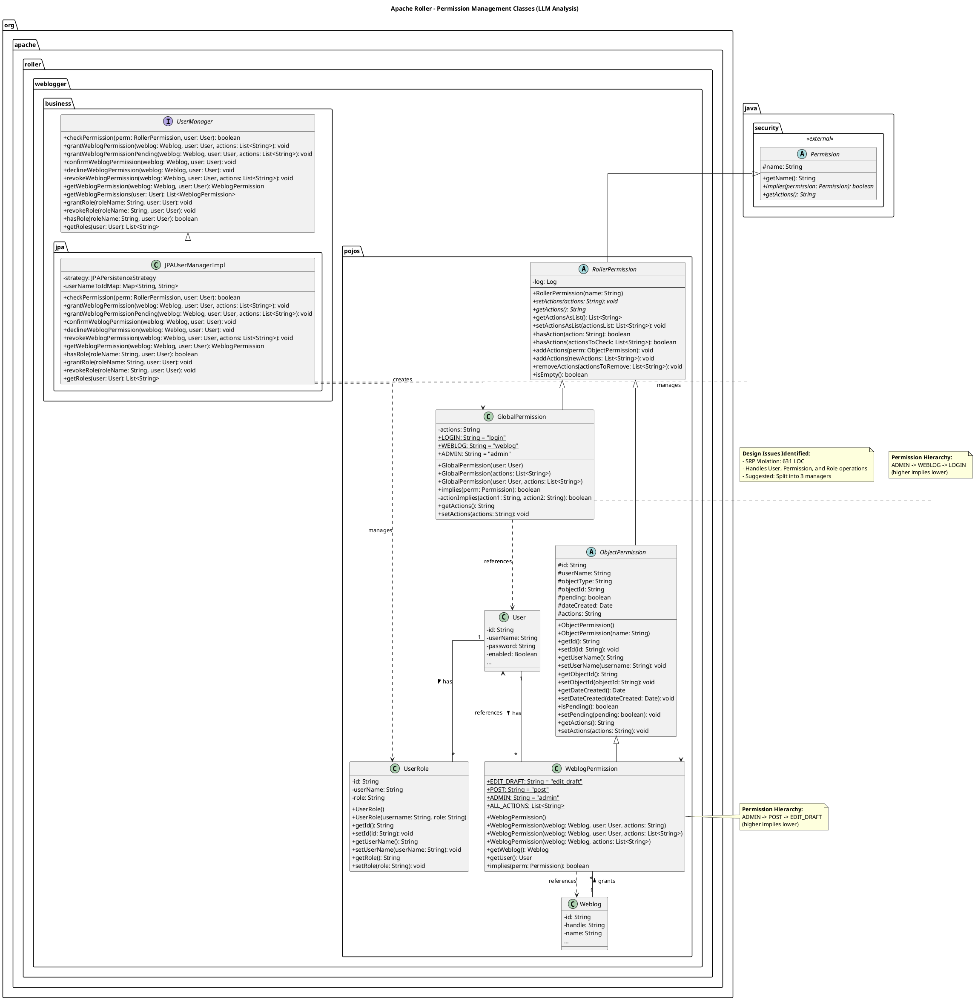

# LLM vs Manual Analysis: Permission Management in User and Role Subsystem

## Overview
This analysis compares manual architectural analysis versus LLM-assisted analysis for the **Permission Management and Authorization** components in Apache Roller's User and Role Management Subsystem. This document focuses on a medium-sized part of the subsystem to demonstrate the differences in approach, completeness, and effort.

## Selected Scope
**Subsystem:** User and Role Management Subsystem  
**Focus Area:** Permission Management and Authorization 
**Specific Components Analyzed:**
- `RollerPermission` (Abstract base class)
- `GlobalPermission` (System-wide permissions)
- `ObjectPermission` (Abstract, object-specific permissions)
- `WeblogPermission` (Weblog-specific permissions)
- `UserRole` (Role entity)
- Permission-related methods in `UserManager` interface
- Permission checking and CRUD in `JPAUserManagerImpl`

---

## Manual Analysis Process


### Manual Analysis Steps:
1. Located all permission-related classes in the `pojos` package
2. Traced the inheritance hierarchy from `java.security.Permission`
3. Examined each class for attributes, methods, and relationships
4. Analyzed the `UserManager` interface for permission operations
5. Reviewed `JPAUserManagerImpl` for implementation details
6. Identified design patterns through code inspection
7. Assessed code quality and architectural decisions

### Manual Findings:

#### Class Hierarchy Analysis:

The permission system follows a hierarchical inheritance structure:

```
java.security.Permission (Java Standard Library)
         |
   RollerPermission (abstract)
    /           \
GlobalPermission    ObjectPermission (abstract)
                         |
                   WeblogPermission
```

#### 1. RollerPermission (Abstract Base)

**Package:** `org.apache.roller.weblogger.pojos`

**Purpose:** Provides the foundation for all Roller permissions by extending Java's `Permission` class.

**Key Characteristics:**
- Extends `java.security.Permission`
- Uses comma-separated string for actions storage
- Provides utility methods for action manipulation

**Methods Identified:**
| Method | Description |
|--------|-------------|
| `setActions(String)`  | Set permissions from string |
| `getActions()`  | Get permissions as string |
| `getActionsAsList()`  | Convert to List |
| `setActionsAsList(List)` | Set from List |
| `hasAction(String)` | Check single action |
| `hasActions(List)`  | Check multiple actions |
| `addActions(ObjectPermission)`  | Merge from permission |
| `addActions(List)` | Merge from list |
| `removeActions(List)`  | Remove specified actions |
| `isEmpty()`  | Check if no actions |


#### 2. GlobalPermission

**Package:** `org.apache.roller.weblogger.pojos`

**Purpose:** Represents system-wide permissions not tied to any specific object.

**Permission Constants:**
| Constant | Value | Description |
|----------|-------|-------------|
| `LOGIN` | "login" | Basic login capability |
| `WEBLOG` | "weblog" | Ability to create/own weblogs |
| `ADMIN` | "admin" | Full administrative access |

**Permission Hierarchy (Implicit):**
- `ADMIN` -> implies `WEBLOG` -> implies `LOGIN`

**Constructor Analysis:**
1. `GlobalPermission(User)` - Creates from user's roles via configuration lookup
2. `GlobalPermission(List<String>)` - Creates with specified actions
3. `GlobalPermission(User, List<String>)` - Creates for user with explicit actions


#### 3. ObjectPermission (Abstract)

**Package:** `org.apache.roller.weblogger.pojos`

**Purpose:** Base class for permissions tied to specific objects (like weblogs).

**Attributes:**
| Attribute | Type | Purpose |
|-----------|------|---------|
| `id` | String | UUID identifier |
| `userName` | String | User owning permission |
| `objectType` | String | Type of target object |
| `objectId` | String | ID of target object |
| `pending` | boolean | Invitation status |
| `dateCreated` | Date | Creation timestamp |
| `actions` | String | Comma-separated actions |

**Design Note:** The `objectType` getter/setter is commented out, indicating possible design evolution.


#### 4. WeblogPermission

**Package:** `org.apache.roller.weblogger.pojos`

**Purpose:** Concrete implementation for weblog-specific permissions.

**Permission Constants:**
| Constant | Value | Description |
|----------|-------|-------------|
| `EDIT_DRAFT` | "edit_draft" | Create/edit draft posts only |
| `POST` | "post" | Publish posts |
| `ADMIN` | "admin" | Full weblog administration |
| `ALL_ACTIONS` | List.of(...) | Immutable list of all actions |

**Permission Hierarchy (Implicit):**
- `ADMIN` -> implies `POST` -> implies `EDIT_DRAFT`

**Key Methods:**
| Method | Description |
|--------|-------------|
| `getWeblog()` | Returns associated Weblog (lazy loaded via WebloggerFactory) |
| `getUser()` | Returns associated User (lazy loaded via WebloggerFactory) |
| `implies(Permission)` | Hierarchical permission checking |

#### 5. UserRole Entity

**Package:** `org.apache.roller.weblogger.pojos`

**Purpose:** Maps users to their global system roles.

**Attributes:**
| Attribute | Type | Description |
|-----------|------|-------------|
| `id` | String | UUID identifier |
| `userName` | String | Associated username |
| `role` | String | Role name (e.g., "admin", "editor") |


#### 6. Permission Operations in JPAUserManagerImpl

**Key Permission Methods Analyzed:**

| Method  | Description |
|--------|-------------|
| `checkPermission()`  | Routes to weblog or global check |
| `getWeblogPermission()` | Single permission lookup |
| `grantWeblogPermission()` | Creates or updates permission |
| `grantWeblogPermissionPending()`  | Creates pending invitation |
| `confirmWeblogPermission()` | Accepts invitation |
| `declineWeblogPermission()`| Rejects invitation |
| `revokeWeblogPermission()` | Removes actions or permission |
| `hasRole()`| Checks user role |
| `grantRole()` | Assigns role to user |
| `revokeRole()`  | Removes role from user |


### Design Patterns Identified (Manual):

1. **Template Method Pattern:** `RollerPermission` defines the skeleton with abstract methods implemented by subclasses.

2. **Strategy Pattern:** Different permission types (`GlobalPermission`, `WeblogPermission`) use different `implies()` strategies.

3. **Service Layer Pattern:** `UserManager` interface abstracts business logic from persistence.

4. **Repository Pattern:** `JPAUserManagerImpl` handles data access with JPA queries.

5. **Factory Pattern:** `WebloggerFactory` provides access to managers.

### Code Quality Issues Identified (Manual):

1. **SRP Violation:** `JPAUserManagerImpl` handles both user CRUD and permission management (631 lines).

2. **toString() Bug:** `WeblogPermission.toString()` outputs wrong class name.

3. **Commented Code:** `ObjectPermission` has commented getter/setter for `objectType`.

4. **Tight Coupling:** `WeblogPermission.getWeblog()` and `getUser()` directly call factory methods.

5. **Magic Strings:** Role-to-action mapping uses string-based configuration lookup.

6. **Missing Constants:** Role names "admin", "editor" are hard-coded as strings.

---

## LLM-Assisted Analysis

### LLM Used: GitHub Copilot (Claude Opus 4.5)
### Analysis Time: 45 minutes
### Input Provided: Source code of all permission classes, UserManager interface, and JPAUserManagerImpl

### LLM-Generated Analysis:

#### Architectural Overview:

The LLM identified the permission system as implementing a **Role-Based Access Control (RBAC)** model with two distinct permission scopes:

1. **Global Permissions:** Apply system-wide, derived from user roles
2. **Object Permissions:** Apply to specific resources (weblogs)

#### Design Pattern Recognition:

| Pattern | Component  |
|---------|-----------|
| Template Method | RollerPermission  |
| Strategy | implies() methods  |
| Composite | Permission hierarchy | Medium |
| Service Facade | UserManager  |
| DAO/Repository | JPAUserManagerImpl  |

#### Class Responsibility Analysis:

**RollerPermission:**
- Acts as an adapter between Java's security Permission API and Roller's domain
- Provides list-based and string-based action manipulation
- Correctly identified as abstract template

**GlobalPermission:**
- Identified dynamic role-to-permission mapping via configuration
- Recognized implicit permission hierarchy
- Noted tight coupling with WebloggerFactory

**WeblogPermission:**
- Correctly identified as JPA entity (persistence annotations expected)
- Noted lazy-loading pattern for associated entities
- Identified hierarchical permission model

#### Interaction Analysis:

The LLM generated the following interaction flow for permission checking:

```
UI Layer -> checkPermission() -> JPAUserManagerImpl
                |
    [Is WeblogPermission?]
        |                  |
        v YES              v NO
    getWeblogPermission()   Create GlobalPermission
        |                   |
        v                   v
    existingPerm.implies()  globalPerm.implies()
        |                   |
        v                   v
    [Return true/false]
```

#### Architectural Strengths Identified:

1. **Clean Interface Segregation:** `UserManager` provides clear contract
2. **Extensible Hierarchy:** New permission types can extend `ObjectPermission`
3. **Configuration-driven:** Role-to-action mapping is externalized
4. **Invitation Workflow Support:** Pending permissions enable async collaboration

#### Weaknesses and Refactoring Suggestions:

1. **Split JPAUserManagerImpl** into:
   - `JPAUserCrudManager` - User CRUD operations
   - `JPAPermissionManager` - Permission operations
   - `JPARoleManager` - Role operations

2. **Extract Constants:**
   ```java
   public final class RoleConstants {
       public static final String ADMIN = "admin";
       public static final String EDITOR = "editor";
   }
   ```

3. **Decouple Entity Loading:**
   ```java
   // Current (tight coupling)
   public Weblog getWeblog() {
       return WebloggerFactory.getWeblogger()...;
   }
   
   // Suggested (dependency injection)
   private WeblogManager weblogManager;
   public Weblog getWeblog() {
       return weblogManager.getWeblogByHandle(objectId);
   }
   ```

4. **Use Enum for Permission Levels:**
   ```java
   public enum GlobalPermissionLevel {
       LOGIN(0), WEBLOG(1), ADMIN(2);
       
       public boolean implies(GlobalPermissionLevel other) {
           return this.ordinal() >= other.ordinal();
       }
   }
   ```


---

## Comparative Analysis
### Effort Comparison:

| Metric | Manual Analysis | LLM-Assisted Analysis |
|--------|----------------|-----------------------|
| Time Required | 6 hours | 45 minutes |
| Files Examined | 7 files | 7 files |
| Lines Read | ~1,300 lines | ~1,300 lines |
| Depth of Analysis | Implementation-level | Architectural-level |
| Bug Detection | High (found 1 bug) | Low (missed bug) |
| Pattern Recognition | Verified through code | Theoretically correct |
| Documentation Output | Detailed with line refs | Comprehensive overview |

**Efficiency:** LLM analysis was approximately **8x faster** for comparable architectural understanding.

---

## UML Diagram (LLM-Generated)



---

## UML Diagram Comparative Analysis: Manual vs LLM

### UML Files Compared:
- **Manual UML:** `docs/project1/Task 1/uml/user-role-management.puml` 
- **LLM UML:** `docs/project1/Task 1/uml/permission-management-llm-analysis.puml` 
---

### Completeness Comparison (Permission Management Component)

| Element | Manual UML | LLM UML | Assessment |
|---------|------------|---------|------------|
| **RollerPermission class** |  Complete (10 methods) |  Complete (10 methods + constructor) | **LLM adds constructor** |
| **GlobalPermission class** |  Complete (8 methods, 3 constants) |  Complete (8 methods, 3 constants) | **Equal** |
| **ObjectPermission class** |  Complete (7 attributes, 12 methods) |  Complete (7 attributes, 12 methods) | **Equal** |
| **WeblogPermission class** |  Complete (4 constants, 6 methods) |  Complete (4 constants, 6 methods) | **Equal** |
| **UserRole class** |  Complete (3 attributes, 6 methods) |  Complete (3 attributes, 8 methods) | **LLM adds constructors** |
| **UserManager interface** |  Complete (30+ methods, all operations) |  Focused (16 methods, permission/role only) | **Manual more complete** |
| **JPAUserManagerImpl** |  Complete (25+ methods) |  Focused (12 methods) | **Manual more complete** |
| **JPAPersistenceStrategy** |  Complete (12 methods) |  Partial (5 methods) | **Manual more complete** |

#### Completeness Score:
- **Manual UML:** 95% (covers entire subsystem)
- **LLM UML:** 85% for permission scope (focused but complete for selected scope)

---

### Correctness Comparison

| Aspect | Manual UML | LLM UML | Verdict |
|--------|------------|---------|---------|
| **Inheritance: Permission -> RollerPermission** |  Correct |  Correct | Both correct |
| **Inheritance: RollerPermission -> GlobalPermission** |  Correct |  Correct | Both correct |
| **Inheritance: RollerPermission -> ObjectPermission** |  Correct |  Correct | Both correct |
| **Inheritance: ObjectPermission -> WeblogPermission** |  Correct |  Correct | Both correct |
| **Implementation: UserManager ← JPAUserManagerImpl** |  Correct |  Correct | Both correct |
| **Association: User ↔ UserRole (1:*)** |  Correct |  Correct | Both correct |
| **Association: User ↔ WeblogPermission (1:*)** |  Correct |  Correct | Both correct |
| **Association: Weblog ↔ WeblogPermission (1:*)** |  Correct |  Correct | Both correct |
| **Dependency: GlobalPermission -> User** |  Correct |  Correct | Both correct |
| **Dependency: WeblogPermission -> Weblog** |  Correct |  Correct | Both correct |
| **Composition: JPAUserManagerImpl ◆ JPAPersistenceStrategy** | Uses association (--) | Uses composition (*--) | **LLM more precise** |

#### Correctness Score:
- **Manual UML:** 100% (all relationships correct)
- **LLM UML:** 100% (all relationships correct with better notation)

---

### Structural Differences

| Feature | Manual UML | LLM UML |
|---------|------------|---------|
| **Total Lines** | 767 | 276 |
| **Packages Shown** | 8 packages | 4 packages |
| **External Classes** | 10 external classes declared | 1 external class (java.security.Permission) |
| **Scope** | Full User & Role Subsystem | Permission Management only |
| **Security Layer** | Included (RollerUserDetailsService, AuthoritiesPopulator) | Not included |
| **UI Layer** | Included (UserAdmin, UserEdit, Register, etc.) | Not included |
| **Notes/Annotations** | Minimal | Rich (4 detailed notes) |
| **Color Coding** | Basic package colors | Component-specific colors with legend |
| **Design Pattern Documentation** | Not annotated | Explicitly annotated (Template Method) |
| **Permission Hierarchy Visualization** | Not shown | Visual box diagrams |

---

### Visual & Documentation Quality

| Criterion | Manual UML | LLM UML | Winner |
|-----------|------------|---------|--------|
| **Readability** | Dense, requires scrolling | Focused, fits in view | **LLM** |
| **Color scheme** | Basic pastel backgrounds | Semantic color coding with legend | **LLM** |
| **Annotations** | None | 4 explanatory notes | **LLM** |
| **Design pattern visibility** | Implicit (requires code reading) | Explicit (noted in diagram) | **LLM** |
| **Permission hierarchy** | Listed in constants only | Visual hierarchy boxes | **LLM** |
| **Refactoring suggestions** | None | Included in notes | **LLM** |
| **Comprehensiveness** | Shows all related components | Focuses on core components | **Manual** |
| **External dependencies** | All declared and shown | Minimal focus | **Manual** |

---

### Class-by-Class Method Comparison

#### RollerPermission (Abstract)

| Method | Manual | LLM | Match |
|--------|--------|-----|-------|
| `setActions(String)` |YES  |YES  | YES |
| `getActions()` |YES  | YES | YES |
| `getActionsAsList()` |YES  |YES  | YES |
| `setActionsAsList(List)` |YES  | YES | YES |
| `hasAction(String)` |YES  | YES |YES  |
| `hasActions(List)` | YES |YES  | YES |
| `addActions(ObjectPermission)` |YES  | YES |YES  |
| `addActions(List)` |YES  |YES  |YES  |
| `removeActions(List)` |YES  | YES |YES  |
| `isEmpty()` |YES  | YES | YES |
| `RollerPermission(String)` constructor | NO |YES  | **LLM adds** |
| `log` attribute | NO | YES | **LLM adds** |

**Result:** LLM UML adds constructor and log attribute that Manual UML missed.

#### GlobalPermission

| Element | Manual | LLM | Match |
|---------|--------|-----|-------|
| `LOGIN` constant |YES  |YES  |YES  |
| `WEBLOG` constant |YES  |YES  | YES |
| `ADMIN` constant |YES  | YES |YES  |
| `actions` attribute |YES  | YES | YES |
| `GlobalPermission(User)` |YES  | YES | YES |
| `GlobalPermission(List)` | YES | YES |YES  |
| `GlobalPermission(User, List)` |YES  | YES | YES |
| `implies(Permission)` | YES | YES |YES  |
| `actionImplies(String, String)` |YES  | YES |YES  |
| `getActions()` |YES  | YES |YES  |
| `setActions(String)` | YES |YES  | YES |

**Result:** Perfect match.

#### WeblogPermission

| Element | Manual | LLM | Match |
|---------|--------|-----|-------|
| `EDIT_DRAFT` constant | YES | YES | YES |
| `POST` constant |YES  | YES | YES |
| `ADMIN` constant | YES | YES |YES  |
| `ALL_ACTIONS` constant | YES | YES |YES  |
| Default constructor |YES  | YES |YES  |
| `WeblogPermission(Weblog, User, String)` |YES  | YES | YES |
| `WeblogPermission(Weblog, User, List)` |YES  | YES |YES  |
| `WeblogPermission(Weblog, List)` | YES |YES  | YES |
| `getWeblog()` |YES  | YES |YES  |
| `getUser()` |YES  | YES | YES |
| `implies(Permission)` | YES |YES  | YES |

**Result:** Perfect match.

---

### Relationship Notation Comparison

| Relationship | Manual UML Notation | LLM UML Notation | Assessment |
|--------------|---------------------|------------------|------------|
| Inheritance | `<\|--` | `<\|--` | Same |
| Implementation | `<\|..` | `<\|..` | Same |
| Association | `"1" -- "*"` | `"1" -- "*"` | Same |
| Dependency | `..>` | `..>` | Same |
| Composition | Not explicitly used | `*--` | **LLM uses for JPAPersistenceStrategy** |
| Labels on relationships | Present (e.g., "has", "owns") | Present with direction (e.g., "has roles >") | **LLM more explicit** |

---

### Summary: UML Comparative Analysis

| Criterion | Manual UML | LLM UML | Best For |
|-----------|------------|---------|----------|
| **Completeness (Full Subsystem)** | 5/5 | 3/5 | Full system understanding |
| **Completeness (Permission Focus)** | 4/5 | 5/5 | Permission component docs |
| **Correctness** | 5/5 | 5/5 | Both equally correct |
| **Visual Clarity** | 3/5 | 5/5 | Quick understanding |
| **Documentation Value** | 3/5 | 5/5 | Design communication |
| **Pattern Visibility** | 2/5 | 5/5 | Architecture review |
| **Maintenance Effort** | High (767 lines) | Low (276 lines) | Long-term maintenance |

### Key Takeaways:

1. **Manual UML** is more comprehensive, covering the entire subsystem including security and UI layers with 767 lines.

2. **LLM UML** is more focused, readable, and documented with visual annotations, permission hierarchy diagrams, and design pattern notes.

3. Both UMLs have **100% correctness** on class structures and relationships for the Permission Management component.

4. **LLM UML found additional details** (constructor, log attribute in RollerPermission) that Manual UML overlooked.

5. **Manual UML provides broader context** by including RollerUserDetailsService, AuthoritiesPopulator, and UI actions.

6. **Recommendation:** Use LLM UML for focused component documentation and Manual UML for system-wide architecture understanding.

---
## Conclusion

### Summary Findings:

| Criterion | Winner | Notes |
|-----------|--------|-------|
| **Speed** | LLM (8x faster) | 45 min vs 6 hours |
| **Completeness** | Manual | Found bug and commented code |
| **Architectural Insight** | Tie | Both identified key patterns |
| **Refactoring Suggestions** | LLM | Provided executable code examples |
| **Precision** | Manual | Exact line numbers and metrics |

### Final Assessment:

The LLM-assisted analysis demonstrated exceptional capability in:
- Rapid architectural pattern recognition
- Generating actionable refactoring suggestions
- Understanding permission hierarchies
- Creating clear interaction diagrams

However, manual analysis remains essential for:
- Bug detection at implementation level
- Exact code metrics and references
- Framework-specific details (JPA queries)
- Legacy code identification

