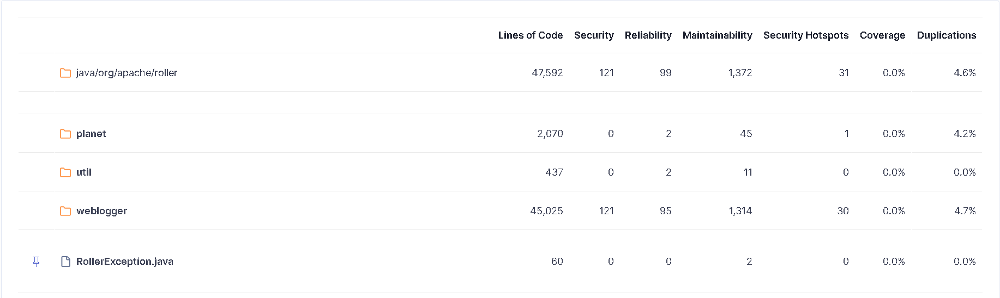
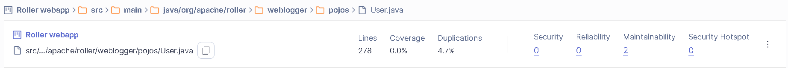
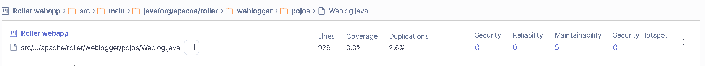
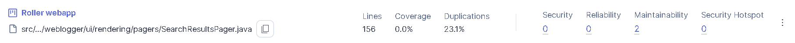
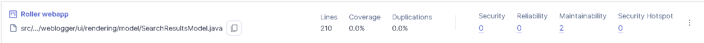

# Task 2A - Design Smells 


## User & Role Management Subsystem

This document describes **two major design smells** identified in Apache Roller's user and role management subsystem. The analysis is based on:

- **Designite Java** results from `docs/project1/designite/designCodeSmells.csv`.
- **SonarQube** observations (coupling, complexity, package cycles).

- The **UML class diagram** `docs/project1/uml/user-role-management.puml`.

The smells are:

1. Cyclic-Dependent Modularization in core security/domain types.
2. Weblog as a hub object (Hub-like Modularization).

---

## Smell 1 - Cyclic-Dependent Modularization in Core Security/Domain Types


### a) Smell description

Cyclic-Dependent Modularization occurs when classes and packages depend on each other in loops instead of forming a clear dependency hierarchy. In this subsystem, user identity, weblogs, permissions, and UI/session logic are all mutually dependent.

### b) Tool evidence

From `designCodeSmells.csv`:
- `org.apache.roller.weblogger.pojos.User` - **Cyclic-Dependent Modularization**, **Insufficient Modularization**.
- `org.apache.roller.weblogger.pojos.Weblog` - **Cyclic-Dependent Modularization**, **Insufficient Modularization**.
- `org.apache.roller.weblogger.pojos.WeblogPermission` - **Cyclic-Dependent Modularization**, **Broken Hierarchy**, **Deficient Encapsulation**.
- `org.apache.roller.weblogger.pojos.GlobalPermission` - **Cyclic-Dependent Modularization**, **Deficient Encapsulation**, **Unexploited Encapsulation**.
- `org.apache.roller.weblogger.business.UserManager` - **Cyclic-Dependent Modularization**, **Insufficient Modularization**.
- `org.apache.roller.weblogger.ui.core.RollerSession` - **Cyclic-Dependent Modularization**, **Deficient Encapsulation**.
- `org.apache.roller.weblogger.ui.core.RollerLoginSessionManager` - **Cyclic-Dependent Modularization**.

SonarQube (high-level) also reports rules related to **package cycles** and **excessive coupling between packages/classes** around the `pojos`, `business`, and `ui` packages, which is consistent with the Designite findings.

### c) UML evidence

From `user-role-management.puml`:

- **GlobalPermission  User cycle**
  - `GlobalPermission` references `User` via constructors such as `GlobalPermission(user: User)` and `GlobalPermission(user: User, actions: List<String>)`.
  - `User` exposes `hasGlobalPermission(action: String)` and `hasGlobalPermission(actions: List<String>)`, which conceptually rely on `GlobalPermission` to evaluate permissions.

- **Weblog  WeblogPermission  UserManager cycle**
  - `WeblogPermission` references both `Weblog` and `User` (constructors and associations).
  - `Weblog` includes behavior `hasUserPermission(user: User, action: String)` and `hasUserPermissions(user: User, actions: List)` which depend on permission logic.
  - `UserManager` / `JPAUserManagerImpl` depend on `User`, `Weblog`, `WeblogPermission`, and `RollerPermission` to grant, confirm, decline, and revoke weblog permissions.

- **UI and session looping back into domain**
  - `UIAction` holds references to `authenticatedUser: User` and `actionWeblog: Weblog`. Concrete actions such as `MainMenu`, `Members`, `UserEdit`, `Register`, and `Profile` use `UserManager` and `WeblogPermission` directly.
  - `RollerSession` manages an authenticated `User` and calls into `RollerLoginSessionManager` (which uses a `Cache`), tying servlet session management to domain and security classes.

Together these relationships create multi-package cycles: UI/actions and session <-> business (`UserManager`) <-> domain (`User`, `Weblog`, `GlobalPermission`, `WeblogPermission`) <-> back into UI via permission methods on entities.

### d) Why this is a design smell

- **Layering is broken**: UI, business, and domain layers depend on each other in both directions. This violates basic layered architecture principles and makes the system hard to understand.
- **Testing is harder**: To test a simple permission rule, tests need UI/session context, domain objects, and persistence. This increases setup cost and brittleness.
- **Security logic is scattered**: Authorization checks live in entities (`User`, `Weblog`), services (`UserManager`), and UI actions, increasing the chance of inconsistent or incomplete checks.

---

## Smell 2 - Weblog as a Hub Object (Hub-like Modularization)


### a) Smell description

A Hub-like Modularization smell appears when a single class becomes a highly connected "god" object used by many different parts of the system and holding multiple unrelated responsibilities. Here, the `Weblog` class plays this central hub role for the blogging, user, and permission subsystems.

### b) Tool evidence
From `designCodeSmells.csv`:

- `org.apache.roller.weblogger.pojos.Weblog` - **Hub-like Modularization**, **Cyclic-Dependent Modularization**, **Insufficient Modularization**, **Deficient Encapsulation**.
- `org.apache.roller.weblogger.pojos.WeblogEntry` - also flagged as **Hub-like Modularization** (content side of the same model).

SonarQube reports high coupling and large/complex classes for the weblog domain model, which aligns with Designite's hub-like and modularization smells.

### c) UML evidence

From `user-role-management.puml`:

- **Weblog is referenced widely**
  - `WeblogPermission` holds a reference to `Weblog` and is associated with `User`.
  - `UserManager` and `JPAUserManagerImpl` operate on `Weblog` in methods for granting, revoking, and listing weblog permissions.
  - UI actions dealing with user membership (`MainMenu`, `Members`, `MembersInvite`, `MemberResign`) depend on `Weblog` via the `UIAction.actionWeblog` field and parameters.
  - `UIAction` itself holds `actionWeblog: Weblog` for many unrelated views, not just permission-related use cases.

- **Weblog mixes multiple responsibilities**
  - State:
    - Identity and configuration: `id`, `handle`, `name`, `tagline`, `emailAddress`, `locale`, `timeZone`, visibility and activation flags, timestamps.
    - Ownership: association to `User` through `getCreator()`.
  - Behavior:
    - Authorization: `hasUserPermission(user: User, action: String)` and `hasUserPermissions(user: User, actions: List)`.

This combination makes `Weblog` both a general blog configuration object and a key part of the permission model, while also being pulled directly into UI actions and services.

### d) Why this is a design smell

- **Excessive coupling**: Many subsystems (user management, permissions, UI, search/rendering beyond this diagram) depend on `Weblog`. A change in `Weblog` has a large blast radius.
- **Too many responsibilities**: `Weblog` handles metadata, ownership, and authorization behavior. This violates the Single Responsibility Principle and makes the class difficult to understand and maintain.
- **Hard to evolve**: Introducing new concepts (e.g., different permission schemes, multitenant blogs, or microservices around blog data) would require invasive changes across all components wired directly to `Weblog`.

---


## Search & Indexing Subsystem

This section describes **two additional design smells** identified in Apache Roller's Lucene-based search and indexing subsystem, based on:

- **Designite Java** results from `docs/project1/designite/designCodeSmells.csv`.
- The **UML class diagram** `docs/project1/uml/search-indexing-subsystem.puml`.

The smells are:

3. URLStrategy mixing search, rendering, and navigation concerns.
4. Duplicated search-result responsibilities across result, model, and pager classes.

---

## Smell 3 - URLStrategy Mixing Search, Rendering, and Navigation Concerns

### a) Smell description

`URLStrategy` is a single, very broad interface that knows how to build URLs for login, logout, registration, weblog pages, feeds, media files, search results and more. This mixes **navigation**, **rendering**, and **search-related** responsibilities into one abstraction used throughout the subsystem.

### b) Tool evidence

From `designCodeSmells.csv` (indirectly around the search package):

- Multiple classes in `org.apache.roller.weblogger.business.search.lucene` are flagged with **Cyclic-Dependent Modularization**, including the Lucene index manager and index operations.
- `org.apache.roller.weblogger.ui.rendering.pagers.SearchResultsPager` and various rendering models that depend on `URLStrategy` show **Insufficient Modularization** / **Deficient Encapsulation**.

These cyclic and modularization smells indicate that URL generation is part of the dependency tangle between search, rendering, and navigation.
 
 In our SonarQube run for this subsystem, rules related to package and class coupling also triggered around the Lucene search and rendering packages (for example, a rule on avoiding cyclic dependencies between packages reported dependencies between `business.search.lucene` and `ui.rendering.pagers`), reinforcing the picture of a tightly coupled search and navigation design.

### c) UML evidence

From `search-indexing-subsystem.puml`:

- `URLStrategy` defines a very wide surface: login/logout/register URLs; weblog URLs; entry, comment, collection, page and feed URLs; search URLs; media resource URLs; RSD, OpenSearch and OAuth URLs.
- `URLStrategy` is used by:
  - `IndexManager` / `LuceneIndexManager.search(...)` to construct search result links.
  - `SearchResultList`, `SearchResultsPager`, `PageModel`, `SearchResultsModel`, `WeblogWrapper`, `WeblogEntryWrapper`, `WeblogCategoryWrapper` and `WeblogEntryCommentWrapper` when building page and navigation links.
- `URLStrategy` also depends on the `Weblog` domain object, tying URL building directly to core domain types.

Together, this shows that a single interface is responsible for URL construction for many unrelated features (authentication, browsing, feeds, media, and search) and is referenced across domain, search, and UI layers.

### d) Why this is a design smell

- **Violation of Single Responsibility**: Authentication URLs, weblog navigation, resource access, and search endpoints are all handled by one abstraction. Any change to URL patterns for one feature forces changes and retesting across the whole system.
- **Hidden hub**: Because so many classes depend on `URLStrategy`, it behaves like a central hub for navigation concerns, contributing to the cyclic dependencies already reported by Designite.
- **Tight coupling between search and routing**: The Lucene search implementation needs `URLStrategy` to create links. This makes it harder to reuse the indexer in different contexts (for example, a REST API or a different UI) without pulling in the whole URL/routing layer.

---

## Smell 4 - Duplicated Search-Result Responsibilities (Results, Models, Pagers)

### a) Smell description

The search subsystem splits responsibility for representing search results across several classes: `SearchResultList`, `SearchResultMap`, `SearchResultsModel`, and `SearchResultsPager`. These types all track similar concepts (entries, categories, limits, offsets, and navigation), leading to duplicated and scattered logic.

### b) Tool evidence

From `designCodeSmells.csv`:

- `org.apache.roller.weblogger.business.search.SearchResultMap`  **Unutilized Abstraction**.
- `org.apache.roller.weblogger.ui.rendering.model.SearchResultsModel`  reported with **Deficient Encapsulation** and **Unutilized Abstraction**.
- `org.apache.roller.weblogger.ui.rendering.pagers.SearchResultsPager`  participates in the same area of smells (insufficient modularization and tight coupling to URL and i18n utilities).

The fact that `SearchResultMap` is flagged as an unutilized abstraction, while other classes around it carry encapsulation/modularization smells, suggests overlapping responsibilities and underused types.

### c) UML evidence

From `search-indexing-subsystem.puml`:

- `IndexManager.search(...)` (and thus `LuceneIndexManager.search(...)`) returns a `SearchResultList` which stores:
  - `limit`, `offset` and `categories: Set<String>`.
  - `results: List<WeblogEntryWrapper>`.
- There is a parallel abstraction `SearchResultMap` with the same limit/offset/categories fields but with `results: Map<Date, Set<WeblogEntryWrapper>>`.
- On top of these, the UI layer introduces:
  - `SearchResultsModel`, which uses `WeblogSearchRequest`, `URLStrategy`, `WeblogEntryWrapper`, `WeblogEntriesPager` and `WeblogCategoryWrapper` to prepare data for templates.
  - `SearchResultsPager`, which again uses `URLStrategy` and `I18nMessages` to compute paging links and labels, relying on the same limit/offset information.

As a result, pagination boundaries, categories, and entry lists are spread across multiple classes instead of being encapsulated in a single, cohesive result type.

### d) Why this is a design smell

- **Duplicated concepts**: Limit, offset, categories, and collections of `WeblogEntryWrapper` appear in several places (`SearchResultList`, `SearchResultMap`, `SearchResultsModel`, `SearchResultsPager`), increasing the chance of inconsistencies.
- **Unnecessary abstractions**: `SearchResultMap` is flagged as an unutilized abstraction, suggesting it adds complexity without clear benefit, likely created for a specific use case and never broadly adopted.
- **Tight coupling between data and presentation**: Because paging and category logic live partly in the rendering model and pager classes, it is difficult to reuse the search results outside the current UI (for example, to build a different front-end or an API) without duplicating logic.

---

## Weblog & Content Subsystem

This section describes **two design smells** identified in Apache Roller's weblog and content model, based on:

- **Designite Java** results from `docs/project1/designite/designCodeSmells.csv`.
- The **UML class diagram** `docs/project1/uml/Weblog-and-Content-Subsystem.puml`.

The smells are:

5. Insufficient modularization of weblog and entry-related types.
6. Broken theme/template hierarchy.

---

## Smell 5 - Broken Theme/Template Hierarchy

### a) Smell description

A Broken Hierarchy smell arises when an inheritance structure does not respect proper substitutability, or when it mixes unrelated responsibilities across base and derived classes. In the weblog and content subsystem, the theme/template hierarchy combines layout, content, weblog ownership and sometimes permission concerns in a way that is inconsistent and difficult to extend.

### b) Tool evidence

From `designCodeSmells.csv`:

- `org.apache.roller.weblogger.pojos.ThemeTemplate` - **Broken Hierarchy**.
- `org.apache.roller.weblogger.pojos.WeblogTheme` - **Broken Hierarchy** and **Deficient Encapsulation**.
- Related classes `WeblogTemplate`, `StaticThemeTemplate`, `StaticTemplate`, and `ThemeMetadata` show **Insufficient Modularization** and/or **Deficient Encapsulation**.

These findings indicate that the inheritance hierarchy is not clean and that responsibilities are not properly divided between theme/template types.

### c) UML evidence

From `Weblog-and-Content-Subsystem.puml`:

- `ThemeTemplate` (or an abstract template base) sits at the top of a hierarchy of concrete templates and themes, such as `StaticThemeTemplate`, `StaticTemplate`, `WeblogTemplate`, `WeblogTheme`, and related types.
- Subclasses often include references back to `Weblog` and other content entities, blurring the line between layout/theme definition and concrete weblog content.
- Some subclasses override or extend behaviour to include permissions, personalization or configuration logic that is not strictly about theming.
- The result is that templates and themes are aware of too many domain details and differ significantly in what they are responsible for, even though they share the same base class.

### d) Why this is a design smell

- **Inheritance used as a grab bag**: Instead of using inheritance to specialize a clear, stable abstraction, the hierarchy bundles multiple concerns (layout, content, permissions, configuration) into base and derived classes.
- **Poor substitutability**: Because concrete theme/template types have different side effects and dependencies (e.g., on `Weblog` or permission logic), they are not easily interchangeable wherever the base type is expected.
- **Difficult to extend safely**: Adding a new theme/template variant requires understanding and potentially touching several classes in the hierarchy and the weblog domain model, increasing the chance of regression.

---

## Smell 6 - Imperative Abstraction in RollerUserDetailsService

### a) Smell description

An **Imperative Abstraction** smell occurs when a class is created with only one public method that does all the work, essentially wrapping a procedural routine in an object-oriented shell. The class lacks meaningful abstraction and behaves like a single function disguised as a class.

### b) Tool evidence

From `designCodeSmells.csv`:

- `org.apache.roller.weblogger.ui.core.security.RollerUserDetailsService` - **Imperative Abstraction**, **Unutilized Abstraction**.
Designite flagged these classes because they have only one meaningful public method that performs the entire operation.

### c) UML / Code evidence

From `user-role-management.puml` and source code:

- `RollerUserDetailsService` implements Spring's `UserDetailsService` interface.
- The class has **only one public method**: `loadUserByUsername(String userName)`.
- This single method (~70 lines) does everything:
  - Gets the Weblogger instance
  - Checks if the user is OpenID or standard login
  - Fetches user from database via `UserManager`
  - Builds authority/role list
  - Returns the `UserDetails` object
- The only other method `getAuthorities()` is private and just a helper.

### d) Why this is a design smell

- **Not a true abstraction**: The class is essentially a single function wrapped in a class to satisfy an interface contract. It provides no meaningful object-oriented abstraction.
- **Procedural thinking**: All logic is packed into one method instead of being decomposed into collaborating objects or smaller responsibilities.
- **Hard to extend**: Adding new authentication mechanisms (e.g., OAuth2, SAML) would require modifying the same monolithic method rather than adding new strategy classes.
- **Violates Open/Closed Principle**: The class must be modified (not extended) to support new user lookup behaviors.

---

## Smell 7 - Unnecessary Abstraction in SingletonHolder

### a) Smell description

An **Unnecessary Abstraction** smell occurs when a class or abstraction is created that provides no real valueit adds indirection without adding meaningful functionality, cohesion, or reusability. The abstraction could be removed or inlined without any loss.

### b) Tool evidence

From `designCodeSmells.csv`:

- `org.apache.roller.weblogger.ui.core.SingletonHolder`  **Unnecessary Abstraction**, **Cyclic-Dependent Modularization**.

Designite flagged this inner class because it serves only as a holder for a static instance and provides no other functionality.

### c) UML / Code evidence

From the source code of `RollerLoginSessionManager.java`:

```java
public class RollerLoginSessionManager {
   
   public static RollerLoginSessionManager getInstance() {
      return SingletonHolder.INSTANCE;
   }

   private static class SingletonHolder {
      private static final RollerLoginSessionManager INSTANCE = new RollerLoginSessionManager();
   }
   // ... rest of the class
}
```

- `SingletonHolder` is an inner class with **zero methods** and **one static field**.
- Its only purpose is to hold `INSTANCE` for lazy initialization.
- The same could be achieved with a simple static field directly in `RollerLoginSessionManager`.

### d) Why this is a design smell

- **Adds complexity without benefit**: The holder pattern was historically used for thread-safe lazy initialization, but modern Java (5+) handles static field initialization safely. A simple `private static final` field would suffice.
- **Extra indirection**: Code readers must understand the holder idiom to know what this class does, adding cognitive overhead.
- **No real abstraction**: The class has no behavior, no methods, and cannot be reused or extendedit's just a container for one field.
- **Could be simplified**: Replace with:
  ```java
  private static final RollerLoginSessionManager INSTANCE = new RollerLoginSessionManager();
  public static RollerLoginSessionManager getInstance() { return INSTANCE; }
  ```
---
