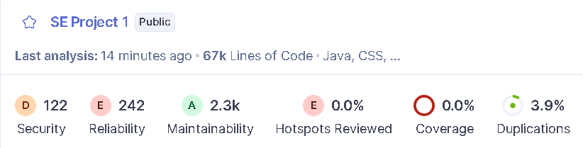

# Task 2B - Code Metrics Analysis

## 1. Tools Used

- **Checkstyle**
  - Configured to report:
    - Cyclomatic Complexity (per method)
    - Class Fan-Out Complexity (per class)
    - Method Length (lines of code per method)
  - Representative report: [docs/project1/Task 2B/check-style-report.txt](docs/project1/Task%202B/check-style-report.txt)

- **Designite Java**
  - Project reports stored in [docs/project1/designite](docs/project1/designite)
  - Used CSVs:
    - Type-level metrics: [docs/project1/designite/typeMetrics.csv](docs/project1/designite/typeMetrics.csv)
    - Method-level metrics: [docs/project1/designite/methodMetrics.csv](docs/project1/designite/methodMetrics.csv)
    - Implementation smells: [docs/project1/designite/implementationCodeSmells.csv](docs/project1/designite/implementationCodeSmells.csv)
 
- **CK (Chidamber & Kemerer) metrics tool**
  - Run as a standalone JAR built from https://github.com/mauricioaniche/ck
  - Executed on the Roller source under `app/src/main/java` with output in [docs/project1/ck-output](docs/project1/ck-output)
  - Used primarily for classic metrics (CBO, WMC, DIT, NOC, RFC, LCOM) via `class.csv` and `method.csv`

We focused on **up to six key metrics** that together cover size, complexity, coupling, inheritance, and cohesion, and for the OO-specific ones we cross-checked Designite's values with CK's CK-style metrics.

## 2. Selected Metrics (Summary)

| # | Metric                           | Level   | Source Tool                                |
|---|----------------------------------|---------|---------------------------------------------|
| 1 | Cyclomatic Complexity (CC)       | Method  | Checkstyle, Designite, CK (method.csv)      |
| 2 | Method Length / LOC              | Method  | Checkstyle, Designite, CK (method.csv)      |
| 3 | Class Fan-Out Complexity         | Class   | Checkstyle                                  |
| 4 | WMC - Weighted Methods per Class | Class   | Designite (typeMetrics), CK (class.csv)     |
| 5 | DIT - Depth of Inheritance Tree  | Class   | Designite (typeMetrics), CK (class.csv)     |
| 6 | LCOM  Lack of Cohesion of Methods | Class | Designite (typeMetrics), CK (class.csv)     |

Below, each metric is defined, illustrated with Roller data, and linked to design/quality implications.

---

## 3. Metric Analyses

### 3.1 Cyclomatic Complexity (CC)

**Definition.**  
Cyclomatic Complexity counts the number of independent paths through a method (roughly, the number of decisions). Higher CC means more branches, more test cases required, and increased risk of defects.

**Evidence in Roller.**

From Checkstyle (see [check-style-report.txt](docs/project1/Task%202B/check-style-report.txt)):

- `org.apache.roller.weblogger.ui.rendering.servlets.PageServlet#doGet`
  - CC = 83 (limit = 10), method length ~ 414 LOC.
- `org.apache.roller.weblogger.util.MailUtil#sendEmailNotification`
  - CC = 54, length ~ 239 LOC.
- `org.apache.roller.weblogger.business.startup.DatabaseInstaller#upgradeTo400`
  - CC = 45, length ~ 438 LOC.
- `org.apache.roller.weblogger.util.HTMLSanitizer#sanitizer`
  - CC = 48, length ~ 245 LOC.
- Multiple other methods with CC between 1530 across business, UI, and utility layers.

Designite's [methodMetrics.csv](docs/project1/designite/methodMetrics.csv) confirms similar trends in smaller subsystems (e.g., `RomeFeedFetcher#buildEntry` with CC 12).

**Implications.**

- **Maintainability:** Methods with CC > 20 are very hard to reason about and modify safely. Changes in `PageServlet#doGet` or `upgradeTo400` are especially risky.
- **Testability:** High CC implies many logical paths; achieving good branch coverage is difficult without a large test suite.
- **Refactoring guidance:** These methods are prime candidates for:
  - Extract Method / Extract Class
  - Splitting large request handlers into smaller, scenario-specific handlers
  - Replacing long `if/else` chains with strategy/state or configuration-driven logic

---

### 3.2 Method Length / Lines of Code (LOC)

**Definition.**  
Method length counts the number of source lines inside a method. Very long methods usually mix multiple responsibilities and make control flow harder to follow.

**Evidence in Roller.**

From Checkstyle (again [check-style-report.txt](docs/project1/Task%202B/check-style-report.txt)):

- `DatabaseInstaller#upgradeTo400`  
  - Length ~ 438 lines (limit = 150).
- `PageServlet#doGet`  
  - Length ~ 414 lines.
- `CommentServlet#doPost`  
  - Length ~ 262 lines.
- `FeedServlet#doGet`, `PreviewServlet#doGet`, `SearchServlet#doGet`, `HTMLSanitizer#sanitizer`, `MailUtil#sendEmailNotification`  
  - Each between ~200260 lines.

Designite's [methodMetrics.csv](docs/project1/designite/methodMetrics.csv) shows that most "normal" methods are < 20 LOC, making these outliers stand out clearly.

**Implications.**

- **Readability:** 200400 line methods are difficult to skim, review, and debug. Developers must keep many details in working memory.
- **Hidden responsibilities:** Length often correlates with violations of the Single Responsibility Principle (e.g., `PageServlet#doGet` mixing parsing, permission checks, routing, rendering, and error handling).
- **Refactoring guidance:** Long methods indicate where to:
  - Extract smaller, intention-revealing methods (e.g., `parseRequest`, `resolveTemplate`, `renderResponse`).
  - Move cohesive chunks into helper classes (e.g., "upgrade" steps into separate upgrade objects).

---

### 3.3 Class Fan-Out Complexity (Coupling to Used Classes)

**Definition.**  
Class Fan-Out Complexity measures how many **other classes** a given class directly depends on. High fan-out means the class is tightly coupled to many others.

**Evidence in Roller (Checkstyle).**

Representative classes from [check-style-report.txt](docs/project1/Task%202B/check-style-report.txt):

- `LuceneIndexManager`  fan-out = 40.
- `JPAMediaFileManagerImpl`  fan-out = 34.
- `JPAWeblogManagerImpl`  fan-out = 34.
- `ThemeManagerImpl`  fan-out = 33.
- `Weblog`  fan-out = 27.
- `WeblogEntry`  fan-out = 26.
- `PageServlet`  fan-out = 26.
- `CommentServlet`  fan-out = 28.
- `RollerContext`  fan-out = 30.
- Several central services (`Weblogger`, `WebloggerImpl`) also slightly exceed the fan-out limit.

Designite's [typeMetrics.csv](docs/project1/designite/typeMetrics.csv) shows **FANOUT** values consistent with this; for example:

- `JPAMediaFileManagerImpl`  FANOUT = 15, LOC = 586, WMC = 88.
- `MultiWeblogURLStrategy`  FANOUT = 4, WMC = 58.
- `WeblogEntryManager`  FANOUT = 7, WMC = 43.
- `URLStrategy`  FANIN = 35 (35 classes use it), FANOUT = 1.

**Implications.**

- **Change ripple:** When many classes depend on `URLStrategy`, `LuceneIndexManager`, or `WeblogEntryManager`, modifying any of them risks widespread breakage.
- **Hotspots:** High fan-out classes often become architectural hubs/god-objects (matching the design smells identified in Task 2A, such as `Weblog` and `URLStrategy`).
- **Refactoring guidance:**
  - Introduce interfaces or faade services to limit direct dependencies.
  - Apply Dependency Inversion (depend on abstractions rather than concrete implementations).
  - Split large managers into more focused services (e.g., separate indexing vs. URL generation).

---

### 3.4 WMC  Weighted Methods per Class

**Definition.**  
WMC is the sum of the complexities of all methods in a class. In Designite's [typeMetrics.csv](docs/project1/designite/typeMetrics.csv), WMC is reported as a simple count of methods weighted by CC. High WMC indicates a class that is both large and complex.

**Evidence in Roller.**

From [typeMetrics.csv](docs/project1/designite/typeMetrics.csv):

- `JPAMediaFileManagerImpl`
  - LOC = 586, WMC = 88.
- `MultiWeblogURLStrategy`
  - LOC = 280, WMC = 58.
- `WeblogEntryManager`
  - LOC = 245, WMC = 43.
- `URLStrategy`
  - LOC = 110, WMC = 30.
- `WebloggerImpl`
  - LOC = 270, WMC = 31.
- `UserManager`
  - LOC = 178, WMC = 31.
- Utility classes such as `DateUtil`
  - LOC = 353, WMC = 69.

**Implications.**

- **Complex "god" classes:** High WMC aligns with classes that centralize many responsibilities (e.g., `WeblogEntryManager` coordinating many entry operations; `JPAMediaFileManagerImpl` handling many media-file use cases).
- **Maintenance cost:** Every additional method and branch increases the cognitive load and test surface.
- **Refactoring guidance:**
  - Use Extract Class to factor out sub-domains (e.g., file-type checking, quota management, indexing).
  - Modularize URL construction (`URLStrategy`, `MultiWeblogURLStrategy`) into smaller strategies for search, feeds, pages, etc.

---

### 3.5 DIT  Depth of Inheritance Tree

**Definition.**  
DIT measures how many inheritance levels a class has above it. A deep tree (large DIT) can increase reuse but also makes behavior harder to understand (more places where methods can be overridden).

**Evidence in Roller.**

From [typeMetrics.csv](docs/project1/designite/typeMetrics.csv):

- Many classes have DIT = 0 or 1 (no inheritance or single-level inheritance).
- Some key abstractions show slightly deeper inheritance:
  - `AbstractURLStrategy`  DIT ~ 1.
  - `MultiWeblogURLStrategy`  DIT ~ 2.
  - `PreviewURLStrategy`  DIT ~ 3.
  - Template/theme hierarchies (not all shown in the snippet) also exhibit non-trivial inheritance depth.

**Implications.**

- **Positive:** Overall, Roller does **not** suffer from extremely deep inheritance trees at the code level; most DIT values are small.
- **Risk area:** However, in places like URL strategies and theme/template types, inheritance combines with high WMC/CC and coupling, which matches the "Broken Theme/Template Hierarchy" design smell from Task 2A.
- **Refactoring guidance:**
  - Prefer composition over inheritance where subclasses differ in many unrelated aspects.
  - Flatten hierarchies where DIT adds little value but complicates understanding (e.g., unify template behavior behind simpler composition-based objects).

---

### 3.6 LCOM  Lack of Cohesion of Methods

**Definition.**  
LCOM measures how related a class' methods are to each other (via shared fields). Higher LCOM means **lower cohesion** (methods operate on disjoint subsets of data), suggesting that the class is doing too many unrelated things.

**Evidence in Roller.**

From [typeMetrics.csv](docs/project1/designite/typeMetrics.csv):

- Some large data-centric domain types show moderate LCOM:
  - `SubscriptionEntry`  LCOM ~ 0.425, LOC = 209, WMC = 50.
  - `PlanetGroup`  LCOM ~ 0.333, LOC = 122, WMC = 29.
  - `MediaFileTest`, `WeblogEntryTest`  also show non-zero LCOM.
- Others (especially focused utility/test classes) have LCOM near 0.0, indicating good cohesion.

**Implications.**

- **Mixed responsibilities:** Non-trivial LCOM in types like `SubscriptionEntry` and `PlanetGroup` indicates that they combine multiple roles (e.g., configuration, content, statistics, metadata) rather than separate cohesive components.
- **Refactoring guidance:**
  - Identify clusters of methods/fields that belong together and split into smaller classes (e.g., move stats, configuration, or search criteria into dedicated types).
  - Use value objects for frequently reused concept clusters (e.g., date ranges, pagination info, ownership metadata).

---

## 4. Overall Observations and How Metrics Guide Refactoring

- **Complexity hotspots:**  
  - Extremely high **Cyclomatic Complexity** and **method length** in servlets (`PageServlet`, `FeedServlet`, `CommentServlet`, `SearchServlet`), utilities (`HTMLSanitizer`, `MailUtil`), and startup code (`DatabaseInstaller`) mark them as clear refactoring targets for Task 3A (e.g., controller decomposition, introducing services).
- **Coupling and god-objects:**  
  - High **Class Fan-Out** and **WMC** in managers and central domain classes (`Weblog`, `WeblogEntry`, `WeblogEntryManager`, `LuceneIndexManager`, `URLStrategy`, `WebloggerImpl`) align with the hub-like and cyclic-dependency smells identified in Task 2A.
- **Structure vs. behavior:**  
  - **DIT** values are moderate, but combined with WMC and coupling in template/theme and URL strategy hierarchies, they signal brittle inheritance structures (matching the "Broken Theme/Template Hierarchy" smell).
- **Cohesion:**  
  - **LCOM** values highlight specific domain types where responsibilities could be split (e.g., `SubscriptionEntry`, `PlanetGroup`), supporting the "Insufficient Modularization" smell.

**How this informs Task 3 (Refactoring):**

- We will primarily target:
  - High-CC, long methods for **behavioral decomposition** (Extract Method, Introduce Parameter Object).
  - High-WMC and high-fan-out classes for **structural decomposition** (Extract Class, introduce faade/adapter).
  - Moderate-to-high LCOM types for **separating responsibilities** (splitting configuration, permission, and content concerns).
- After refactoring, we will re-run the same metrics (Task 3B) to quantitatively check:
  - Reduced CC and LOC for key methods.
  - Lower fan-out and WMC for central managers.
  - Improved cohesion (lower LCOM) where responsibilities are split.

---

## 5. SonarQube Baseline Snapshot (SE-Project-1, master)

SonarQube complements the static metrics above by highlighting issues and grades across security, reliability, and maintainability. This snapshot was captured from the baseline scan and is used as a reference point for Task 3B comparisons.

- Baseline SonarQube dashboard
    - 
