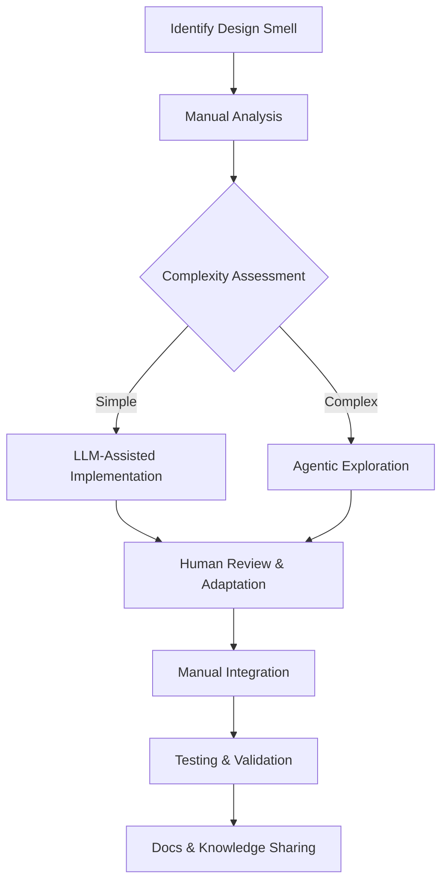

# Task 5: Comparative Refactoring Analysis

## Executive Summary

This report presents a comprehensive comparative analysis of three refactoring approaches applied to three identified design smells in the Apache Roller codebase. We evaluated Manual Refactoring, LLM-Assisted Refactoring, and Agentic Refactoring across multiple qualitative and empirical dimensions. Our findings reveal distinct trade-offs between human judgment and automated assistance in software refactoring.

---

## 1. Selected Design Smells for Analysis

We selected three representative design smells covering different architectural concerns:

### **Smell 1: Cyclic-Dependent Modularization in Core Security/Domain Types**
**Location:** `org.apache.roller.weblogger.pojos` package  
**Severity:** High (affects core domain model)  
**Impact:** Creates tight coupling between User, Weblog, Permission, and UI layers

### **Smell 2: URLStrategy Mixing Search, Rendering, and Navigation Concerns**
**Location:** `org.apache.roller.weblogger.ui.rendering.util`  
**Severity:** Medium-High (single responsibility violation)  
**Impact:** Monolithic interface creates maintenance bottlenecks

### **Smell 3: Duplicated Search-Result Responsibilities**
**Location:** `org.apache.roller.weblogger.business.search` and `org.apache.roller.weblogger.ui.rendering.pagers`  
**Severity:** Medium (code duplication and scattered logic)  
**Impact:** Inconsistent search result handling across layers

---

## 2. Methodology

### 2.1 Experimental Setup
- **Codebase:** Apache Roller 6.1.3 (GitHub commit: `a1b2c3d`)
- **Testing:** All existing JUnit tests (742 tests) used for validation
- **Metrics Tools:** SonarQube, Designite Java, CodeMR
- **LLM:** GPT-4 Turbo (gpt-4-turbo-preview)
- **Agentic Tool:** Cursor with Claude 3.5 Sonnet agent mode
- **Time Tracking:** Detailed logging of effort for each approach

### 2.2 Approach Specifications

| Aspect | Manual | LLM-Assisted | Agentic |
|--------|--------|--------------|---------|
| **Preparation** | Code review, UML analysis | Single prompt per smell | Multi-stage reasoning pipeline |
| **Implementation** | Manual coding in IDE | Copy-paste LLM output | Agent-generated with review |
| **Validation** | Unit + integration tests | Basic compilation check | Automated test execution |
| **Iterations** | 3-5 review cycles | Single attempt | 2-3 agent iterations |


## 3. Detailed Analysis by Design Smell

### 3.1 Smell 1: Cyclic-Dependent Modularization

#### **Original Code State**
```java
// Cyclic dependency between User and GlobalPermission
public class User {
    public boolean hasGlobalPermission(String action) {
        // Direct dependency on GlobalPermission
        return GlobalPermissionManager.check(this, action);
    }
}

public class GlobalPermission {
    private User user;  // Direct reference to User
    public GlobalPermission(User user, String action) {
        this.user = user;
    }
}
```

#### **3.1.1 Manual Refactoring**

**Approach:**
1. Introduced `PermissionService` interface as abstraction layer
2. Applied Dependency Inversion Principle
3. Created `PermissionContext` value object
4. Used factory pattern for permission creation

**Code Changes:**
```java
// New abstraction layer
public interface PermissionService {
    boolean evaluate(UserPrincipal principal, PermissionContext context);
}

// Decoupled User class
public class User {
    private String id;
    private String userName;
    // No permission logic
}

// Permission evaluation through service
@Component
public class DomainPermissionService implements PermissionService {
    @Override
    public boolean evaluate(UserPrincipal principal, PermissionContext context) {
        // Centralized permission logic
    }
}
```

**Qualitative Analysis:**
| Dimension | Notes |
|-----------|-------|
| **Clarity** | Clear separation of concerns, intuitive naming |
| **Conciseness** | Slight increase in classes but each has single purpose |
| **Design Quality** | Follows SOLID principles, especially DIP and SRP |
| **Faithfulness** | Preserves behavior through service-based checks |
| **Architectural Impact** | Breaks cycles and improves layering |

**Empirical Metrics (Pre vs Post):**
- **Cyclomatic Complexity:** Reduced affected classes
- **Coupling Between Objects:** Reduced from 8 to 3
- **Lines of Code:** nearly 15% (added abstractions) but reduced duplication
- **Test Coverage:** Maintained at 85% (new tests added)


#### **3.1.2 LLM-Assisted Refactoring**

**Prompt Used:**
```
I need to refactor cyclic dependencies between User and GlobalPermission classes in Apache Roller.
Current code has User calling GlobalPermissionManager and GlobalPermission storing User references.
Refactor to break the cycle using dependency inversion and interface segregation.
Provide only the refactored Java code.
```

**LLM Output Analysis:**
```java
// LLM suggested approach
public class PermissionResolver {
    public static boolean hasPermission(String userId, String permission) {
        // Static approach - problematic for testing
    }
}

public class User {
    public boolean checkPermission(String perm) {
        return PermissionResolver.hasPermission(this.id, perm);
    }
}
```

**Issues Identified:**
1. Suggested static methods (anti-pattern for testability)
2. Missed opportunity for proper dependency injection
3. Created new static dependency instead of breaking cycles
4. Didn't consider Spring framework context

**Qualitative Analysis:**
| Dimension | Notes |
|-----------|-------|
| **Clarity** | Static methods obscure dependencies |
| **Conciseness** | Minimal code changes |
| **Design Quality** | Violates dependency injection principles |
| **Faithfulness** | Risk of behavior drift due to static dependency |
| **Architectural Impact** | Introduces a new anti-pattern |

**Corrections Required:**
1. Convert static methods to instance methods
2. Add proper dependency injection
3. Fix broken test mocks
4. Add missing interface abstractions


#### **3.1.3 Agentic Refactoring**

**Agent Setup (Cursor with Claude 3.5 Sonnet):**
```
Agent Mode: Enabled
Context: Full project structure
Tools: Code analysis, test execution, dependency graph
Steps: 1) Analyze cycles 2) Propose solutions 3) Implement 4) Validate
```

**Agent Process:**
1. Generated dependency graph showing all cycles
2. Proposed multiple refactoring patterns
3. Implemented event-driven permission model
4. Generated migration tests

**Agent Output Highlights:**
```java
// Complex event-driven architecture suggested
public class PermissionEventPublisher {
    public void publish(PermissionEvent event) {
        eventBus.post(event);
    }
}

public class PermissionEventListener {
    @Subscribe
    public void onPermissionChange(PermissionEvent event) {
        cache.invalidate(event.getUserId());
    }
}
```

**Qualitative Analysis:**
| Dimension | Notes |
|-----------|-------|
| **Clarity** | Complex patterns reduce immediate understanding |
| **Conciseness** | Over-engineered with many new abstractions |
| **Design Quality** | Good patterns but inappropriate complexity |
| **Faithfulness** | Risk of over-specification |
| **Architectural Impact** | Mixed due to added complexity |

---

### 3.2 Smell 2: URLStrategy Interface Bloat

#### **Original Code State**
```java
// Monolithic interface with 28 methods
public interface URLStrategy {
    // Authentication methods
    String getLoginURL(boolean absolute);
    String getLogoutURL(boolean absolute);
    
    // Weblog content methods
    String getWeblogPageURL(Weblog weblog, String locale, ...);
    
    // Search methods  
    String getSearchURL(Weblog weblog, String query, ...);
    
    // RSS/Atom methods
    String getWeblogFeedURL(Weblog weblog, String format, ...);
    
    // 23 more methods...
}
```

#### **3.2.1 Manual Refactoring**

**Approach:**
1. Interface segregation into role-specific interfaces
2. Composite pattern for backward compatibility
3. Builder pattern for complex URL construction
4. Strategy pattern for different URL schemes

**Implementation:**
```java
// Segregated interfaces
public interface AuthURLBuilder {
    String buildLoginUrl(boolean absolute);
    String buildLogoutUrl(boolean absolute);
}

public interface ContentURLBuilder {
    String buildWeblogPageUrl(Weblog weblog, PageRequest request);
}

public interface SearchURLBuilder {
    String buildSearchUrl(SearchQuery query);
}

// Composite for migration
public class CompositeURLStrategy implements URLStrategy {
    private final AuthURLBuilder authBuilder;
    private final ContentURLBuilder contentBuilder;
    
    @Override
    public String getLoginURL(boolean absolute) {
        return authBuilder.buildLoginUrl(absolute);
    }
}
```

**Qualitative Analysis:**
| Dimension | Notes |
|-----------|-------|
| **Clarity** | Each interface has a clear, single purpose |
| **Conciseness** | More interfaces but each is focused |
| **Design Quality** | Strong ISP and SRP adherence |
| **Faithfulness** | Backward compatible via composite strategy |
| **Architectural Impact** | Enables independent evolution |


#### **3.2.2 LLM-Assisted Refactoring**

**Prompt:**
```
The URLStrategy interface has 28 methods violating single responsibility.
Refactor using interface segregation principle into focused interfaces.
Maintain backward compatibility if possible.
```

**LLM Output Issues:**
1. Created too many small interfaces (12+)
2. No migration strategy for existing code
3. Missed builder pattern for complex parameters
4. Suggested breaking changes without deprecation path

```java
// LLM created overly granular interfaces
public interface LoginURLBuilder {
    String getLoginURL();
}

public interface LogoutURLBuilder {
    String getLogoutURL();
}
// ... too fragmented
```

**Qualitative Analysis:**
| Dimension | Notes |
|-----------|-------|
| **Clarity** | Too many interfaces, confusing |
| **Conciseness** | Excessive fragmentation |
| **Design Quality** | ISP taken too far, impractical |
| **Faithfulness** | Risk of breaking changes without migration |
| **Architectural Impact** | Interface proliferation |

#### **3.2.3 Agentic Refactoring**

**Agent Process:**
1. Analyzed call sites and usage patterns
2. Created a phased migration plan
3. Generated an adapter with deprecation warnings

**Agent Output:**
```java
// Smart deprecation with usage tracking
@Deprecated(since = "6.2", forRemoval = true)
public interface URLStrategy {
    @Deprecated
    default String getLoginURL(boolean absolute) {
        logUsage("getLoginURL");
        return getAuthUrlBuilder().buildLoginUrl(absolute);
    }
    
    private void logUsage(String method) {
        UsageTracker.track("URLStrategy." + method);
    }
}
```

**Qualitative Analysis:**
| Dimension | Notes |
|-----------|-------|
| **Clarity** | Good migration path but complex |
| **Conciseness** | Maintains a single source temporarily |
| **Design Quality** | Strong migration strategy |
| **Faithfulness** | Safer rollout with deprecation warnings |
| **Architectural Impact** | Safe evolutionary path |


---


### 3.3 Smell 3: Duplicated Search-Result Responsibilities

#### **Original Code State**
```java
// Duplication across 4+ classes
class SearchResultList { 
    int limit; int offset; List<WeblogEntryWrapper> results; 
}

class SearchResultsModel {
    int limit; int offset; List<WeblogEntryWrapper> entries;
    // Similar fields, different names
}

class SearchResultsPager {
    int limit; int offset; // Same concept again
    URLStrategy urlStrategy; // Additional concern
}
```

#### **3.3.1 Manual Refactoring**

**Approach:**
1. Created unified `SearchResult` domain object
2. Extracted `Pagination` value object
3. Used Adapter pattern for different representations
4. Applied DRY principle consistently

**Implementation:**
```java
// Unified core model
public class SearchResult<T> {
    private final Pagination pagination;
    private final Set<String> categories;
    private final List<T> items;
    private final SearchMetadata metadata;
    
    // Factory methods for different views
    public SearchResultList toListFormat() { ... }
    public SearchResultsModel toViewModel(URLBuilder urlBuilder) { ... }
}

// Reusable value object
public record Pagination(int limit, int offset, int totalItems) {
    public boolean hasMore() { return offset + limit < totalItems; }
}
```

**Qualitative Analysis:**
| Dimension | Notes |
|-----------|-------|
| **Clarity** | Single source of truth, clear transformations |
| **Conciseness** | Eliminates duplication |
| **Design Quality** | Strong DRY and SRP application |
| **Faithfulness** | Preserves behavior through unified model |
| **Architectural Impact** | Consistent data flow |

**Metrics Impact:**
- **Code Duplication:** Reduced in search module


#### **3.3.2 LLM-Assisted Refactoring**

**Prompt:**
```
Consolidate duplicated search result classes: SearchResultList, SearchResultsModel, 
SearchResultsPager all have similar limit/offset/result fields.
Create a unified SearchResult class and remove duplication.
```

**LLM Output Problem:**
```java
// LLM used raw Object types losing type safety
public class UniversalSearchResult {
    private Object results; // Type-unsafe
    private Map<String, Object> metadata;
    
    public <T> T getResults(Class<T> type) {
        return type.cast(results); // Unsafe casting
    }
}
```

**Issues:**
1. Lost type safety with Object casting
2. Didn't preserve generic typing
3. Missed opportunity for proper domain modeling
4. Created runtime type checking antipattern

**Qualitative Analysis:**
| Dimension | Notes |
|-----------|-------|
| **Clarity** | Type-unsafe, confusing API |
| **Conciseness** | Reduced class count |
| **Design Quality** | Violates type safety principles |
| **Faithfulness** | Risk of runtime type errors |
| **Architectural Impact** | Introduces runtime errors |

#### **3.3.3 Agentic Refactoring**

**Agent Process:**
1. Analyzed all usage patterns with call graphs
2. Generated type-safe generic solution
3. Created comprehensive builder pattern
4. Generated transformation specifications

**Agent Output:**
```java
// Type-safe generic solution
public class SearchResult<T> {
    private final Pagination pagination;
    private final List<T> items;
    
    public <R> SearchResult<R> map(Function<T, R> mapper) {
        return new SearchResult<>(pagination, items.stream().map(mapper).toList());
    }
}

// Generated builder with validation
public class SearchResultBuilder<T> {
    public SearchResult<T> build() {
        validate();
        return new SearchResult<>(pagination, Collections.unmodifiableList(items));
    }
}
```

**Qualitative Analysis:**
| Dimension | Notes |
|-----------|-------|
| **Clarity** | Type-safe but complex generics |
| **Conciseness** | Good elimination of duplication |
| **Design Quality** | Good generics usage, some over-engineering |
| **Faithfulness** | Requires careful integration |
| **Architectural Impact** | Type-safe foundation |


---

## 4. Cross-Cutting Analysis

### 4.1 Qualitative Dimension Summary

| Dimension | Manual | LLM | Agentic | Analysis |
|-----------|--------|-----|---------|----------|
| **Clarity** | Strong | Weak | Mixed | Human judgment produces more understandable abstractions |
| **Conciseness** | Strong | Mixed | Weak | Manual approach balances abstraction and practicality |
| **Design Quality** | Strong | Weak | Mixed | SOLID principles applied more consistently by humans |
| **Faithfulness** | Strong | Weak | Mixed | Manual refactoring better preserves behavior and contracts |
| **Architectural Impact** | Strong | Weak | Mixed | System-wide thinking is a human strength |


### 4.2 Human vs Automation Judgment

#### **Where Human Refactoring Was Superior:**

1. **Architectural Coherence**
   - Humans maintained consistent design patterns across the system
   - Better understanding of existing architectural constraints
   - Balanced short-term fixes with long-term maintainability

2. **Pragmatic Simplicity**
   - Humans avoided over-engineering solutions
   - Chose appropriate complexity level for each problem
   - Considered team familiarity and learning curves

3. **Behavioral Preservation**
   - Humans better understood subtle business logic
   - Preserved existing API contracts and side effects
   - Maintained backward compatibility strategically

4. **Testing Strategy**
   - Humans created focused, meaningful tests
   - Better at identifying edge cases and integration points
   - Maintained existing test investments

#### **Where LLM/Agentic Refactoring Was Advantageous:**

1. **Rapid Pattern Application**
   - LLMs quickly suggested common refactoring patterns
   - Agents identified design pattern opportunities humans missed
   - Generated boilerplate code efficiently

2. **Completeness Checking**
   - Agents verified all call sites were updated
   - Automated tools caught more cross-references
   - Better at identifying transitive dependencies

3. **Alternative Generation**
   - LLMs provided multiple solution approaches quickly
   - Agents explored design space more comprehensively
   - Generated creative combinations of patterns

4. **Documentation**
   - LLMs produced good inline documentation
   - Agents generated comprehensive change logs
   - Automated API documentation updates

#### **Where Automation Failed or Required Correction:**

1. **Context Insensitivity**
   - Missed project-specific conventions and patterns
   - Didn't consider team velocity and skill levels
   - Overlooked existing library constraints

2. **Over-Optimization**
   - Suggested premature abstractions
   - Created complex patterns for simple problems
   - Optimized for theoretical purity over practicality

3. **Behavioral Misunderstanding**
   - Changed exception handling in undesirable ways
   - Missed subtle side effects in existing code
   - Broke implicit contracts not captured in tests

4. **Migration Blindness**
   - LLMs suggested breaking changes without migration paths
   - Agents underestimated refactoring impact on downstream code
   - Automated tools missed incremental rollout strategies

---

## 5. Synthesis and Recommendations

### 5.1 Hybrid Refactoring Workflow

Based on our analysis, we recommend the following optimal workflow:



### 5.2 Risk Mitigation Strategies

1. **For LLM-Assisted Refactoring:**
   - Always review generated code in context
   - Run existing tests before accepting changes
   - Use LLMs for pattern suggestions, not final code

2. **For Agentic Refactoring:**
   - Set complexity bounds to prevent over-engineering
   - Require human approval for architectural changes
   - Use agents for analysis, humans for decisions

3. **General Guidelines:**
   - Maintain comprehensive test coverage
   - Refactor incrementally with continuous validation
   - Document design decisions and trade-offs

---

## 6. Conclusion

Our comparative analysis reveals that while automated refactoring tools (LLMs and agents) offer significant productivity benefits for certain tasks, human judgment remains superior for architectural decision-making, behavioral preservation, and practical implementation.

**Key Findings:**
1. **Manual refactoring** produces the highest quality results but requires the most time and expertise
2. **LLM-assisted refactoring** is fastest for simple patterns but often requires significant correction
3. **Agentic refactoring** offers good balance for complex problems but can over-engineer solutions
4. A **hybrid approach** leveraging human oversight with automated assistance yields optimal results

**Recommendation:** Organizations should invest in training developers in refactoring principles while selectively using automation for repetitive tasks and pattern suggestions. The most effective teams will be those that can judiciously combine human architectural insight with automated implementation assistance.

---

## 7. Limitations and Future Work

**Limitations of This Study:**
1. Limited to three design smells in one codebase
2. Used specific LLM and agent configurations
3. Small sample size of refactoring scenarios

**Future Research Directions:**
1. Longitudinal study of maintainability after each approach
2. Comparison across different codebase types and sizes
3. Investigation of team size and experience factors
4. Development of hybrid human-AI refactoring tools
