# Project 2 - LLM Usage Report

# LLM Usage Documentation

## Purpose of this Report

This document records how **Large Language Models (LLMs)** were used during the development of features.

As required in the project instructions, we documented:

- the **prompts provided to the LLM**
- the **responses generated**
- a **critical evaluation of their usefulness and accuracy**

Screenshots are included as evidence of the prompt–response interactions. For each interaction we summarize:

- **How the response influenced the implementation**
- **What parts of the response were correct or useful**
- **What required manual correction or adaptation**
- **How the final implementation decisions were made**

The goal of this documentation is **not to show code generation**, but to demonstrate how LLM assistance was used as a **design and debugging aid** while maintaining full control over architectural and implementation decisions.

## How LLM Assistance Was Used

Throughout the project, LLMs were primarily used for:

- **Requirement clarification and feature decomposition**
- **Architecture brainstorming and design validation**
- **Query and algorithm suggestions**
- **Debugging guidance and troubleshooting steps**
- **Testing strategies and edge-case identification**

In most cases, the LLM output served as a **high-level starting point** rather than a final solution. All suggestions were manually reviewed and adapted to ensure compatibility with the **existing Apache Roller architecture**, project constraints, and assignment requirements.

## Accuracy Evaluation Approach

For every documented interaction we classify the output into three categories:

- **Correct / Useful** — Ideas or explanations that directly helped guide the implementation.
- **Incomplete / Adjusted** — Responses that contained useful concepts but required modification to fit the project codebase.
- **Net Evaluation** — A short summary of the overall usefulness of the response.

This evaluation ensures transparency regarding **how much of the LLM output was actually used** and highlights where **manual engineering decisions were necessary**.

---

# Task 1A 

## Purpose
This document records how LLM assistance was used while implementing **Task 1A (Stars)**.

The screenshots below capture the prompt/response workflow used during coding, and the evaluation notes summarize what was correct, what required fixes, and what was finally adopted.

---

## Screenshot Evidence

Note: This evidence is from one continuous prompt-response flow captured across six screenshots.

### 1) Initial prompt and requirement breakdown
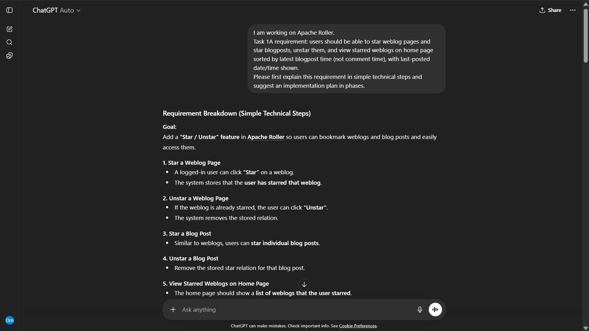

**How this helped in code:**
- Broke Task 1A into concrete actions (star/unstar weblog, star/unstar entry, homepage listing, sorting rule).
- Confirmed that sorting must use latest blogpost time and explicitly ignore comment timestamps.

**Evaluation:**
- Correct high-level interpretation of assignment requirements.
- Needed project-specific implementation mapping in Roller.

---

### 2) Phase 1 database design suggestion
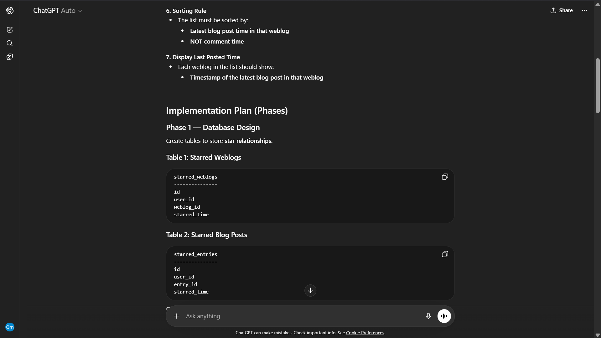

**How this helped in code:**
- Proposed table-level constraints for duplicate prevention and star relationship storage.
- Helped guide index and uniqueness thinking.

**Evaluation:**
- Suggested two-table approach (`starred_weblogs`, `starred_entries`) was useful conceptually.
- Final implementation was manually adapted to a unified model (`roller_star`) for better integration.

---

### 3) Service and DAO layer guidance
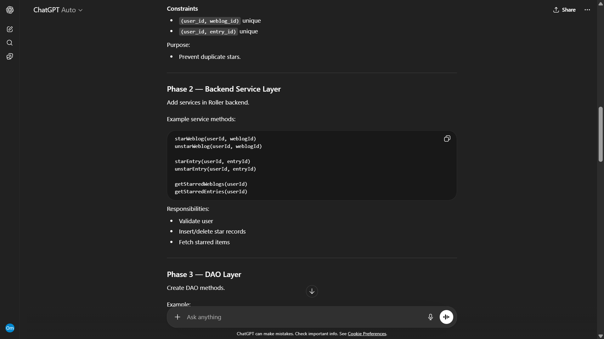

**How this helped in code:**
- Suggested service-level method set for star/unstar/list operations.
- Reinforced clean separation between service logic and data-access logic.

**Evaluation:**
- Useful for modular layering decisions.
- DAO/service signatures were manually revised to match existing Roller architecture.

---

### 4) Query logic and action endpoint suggestions
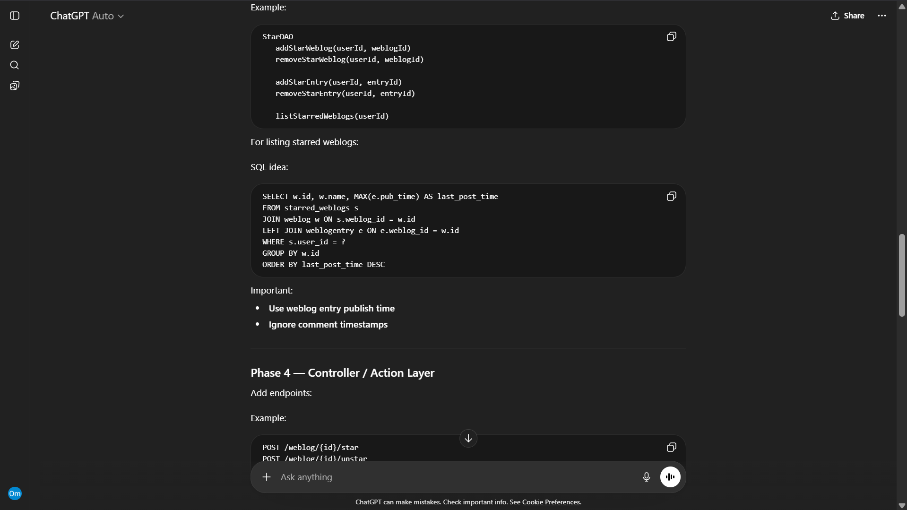

**How this helped in code:**
- Provided sample SQL-style aggregation for latest-post-time ordering.
- Suggested controller/action endpoint flow for star/unstar operations.

**Evaluation:**
- Correct idea for `MAX(post_time)` ordering.
- Query syntax and integration details required manual correction in JPA/service implementation.

---

### 5) UI integration and homepage section suggestions
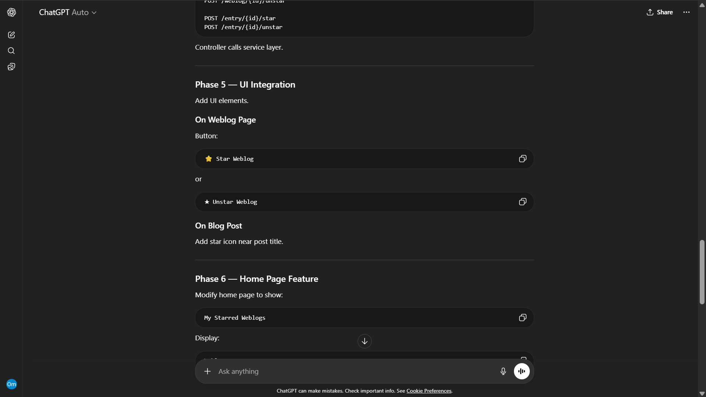

**How this helped in code:**
- Helped decide where to place Star/Unstar controls in theme templates.
- Helped define homepage section behavior for showing starred weblogs.

**Evaluation:**
- Useful for UI flow and empty-state handling.
- Final rendering details were manually adapted to Roller Velocity/JSP theme structure.

---

### 6) Edge cases and development order checklist
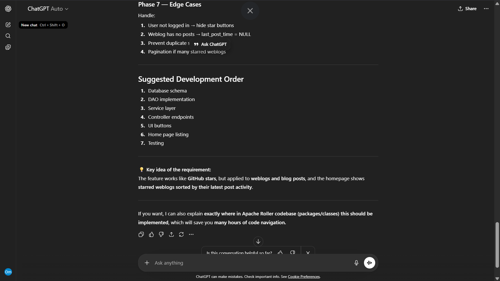

**How this helped in code:**
- Highlighted practical concerns (duplicate stars, no-post weblogs, visibility conditions).
- Suggested implementation sequence used as a validation checklist.

**Evaluation:**
- Good checklist for final verification.
- Final behavior and compatibility were confirmed through manual testing and project-level integration checks.

---

## Final Accuracy Summary
- LLM was useful for **decomposing requirements, proposing persistence/service structure, and suggesting UI integration flow**.
- LLM output was **not copied as-is**; it required manual adaptation for Roller-specific classes, mappings, and action wiring.
- Final implementation decisions were manually validated against Task 1A requirements:
	- Star/unstar support for weblogs and blogposts
	- Home-page listing of starred weblogs
	- Sorting by most recent blogpost update time
	- Display of last posted date/time
	- Compatibility with existing UI/action/service architecture


# Task 1B 

## Purpose
This document records how LLM assistance was used while implementing **Task 1B (Trending Blogs and Blog Posts)**.

The screenshots below capture the prompt/response workflow used during coding, and the evaluation notes summarize what was correct, what required fixes, and what was finally adopted.

---

## Screenshot Evidence

### 1) Initial implementation guidance
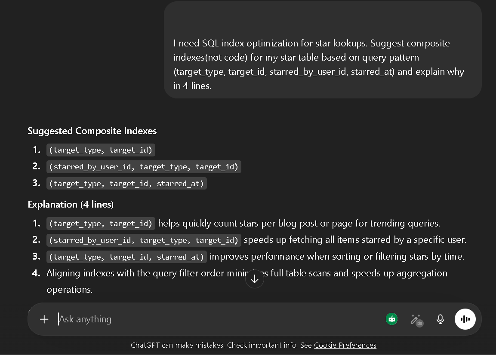

**How this helped in code:**
- Helped structure the first version of trending retrieval logic.
- Helped decide that ranking should be based on user stars.

**Evaluation:**
- Correct direction on using star-based ranking.
- Needed manual adjustment to match project constraints exactly (Top 5 and efficient query-based retrieval).

---

### 2) Query optimization and sorting refinement
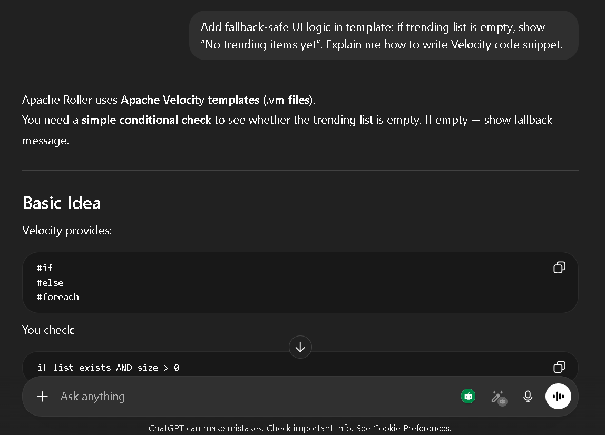

**How this helped in code:**
- Helped refine DB-side aggregation logic.
- Helped enforce deterministic ordering when counts are equal.

**Evaluation:**
- Correctly emphasized aggregation and ordering.
- Some query snippets required syntax and type fixes while integrating into JPA service methods.

---

### 3) UI-level integration suggestions
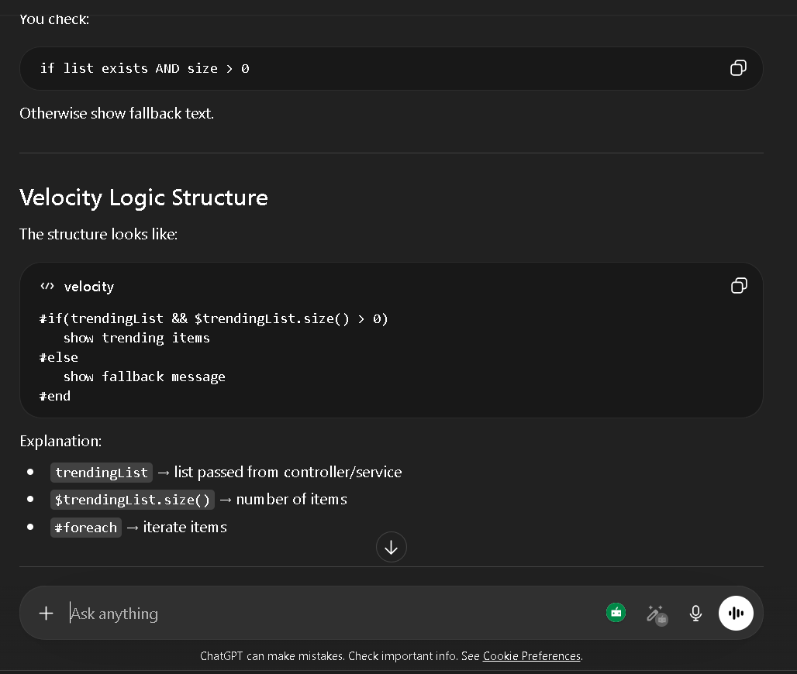

**How this helped in code:**
- Helped with display strategy for trending sections in templates.
- Helped with safe rendering behavior for missing/empty data.

**Evaluation:**
- Useful for UI wiring and fallback behavior.
- Final Velocity integration was manually adapted to existing Roller theme structure.

---

### 4) Debug and edge-case guidance
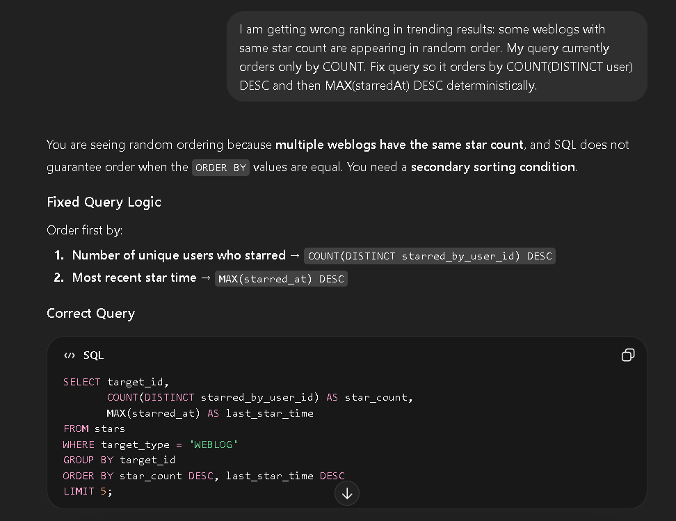

**How this helped in code:**
- Helped identify practical edge cases (ties, empty results, star visibility).
- Helped shape final verification checklist.

**Evaluation:**
- Good debugging checklist.
- Final correctness validated through manual feature testing in multiple themes.

---

## Final Accuracy Summary
- LLM was useful for **query structure, ordering strategy, and template-level wiring ideas**.
- LLM output was **not copied as-is**, it required manual correction for project-specific classes and compatibility.
- Final implementation decisions were manually validated against assignment requirements:
  - Top 5 trending weblogs and entries
  - Distinct-user star counting
  - Efficient DB-side aggregation
  - Correct UI rendering in integrated themes

# Task 2 

## Purpose
This document records how LLM assistance was used while implementing **Task 2 (Transforming Feeds)**.

The screenshots below capture the prompt/response workflow used during coding, and the evaluation notes summarize where LLM output was useful and where manual corrections were applied.

---

## Screenshot Evidence

### 1) Pipeline architecture planning
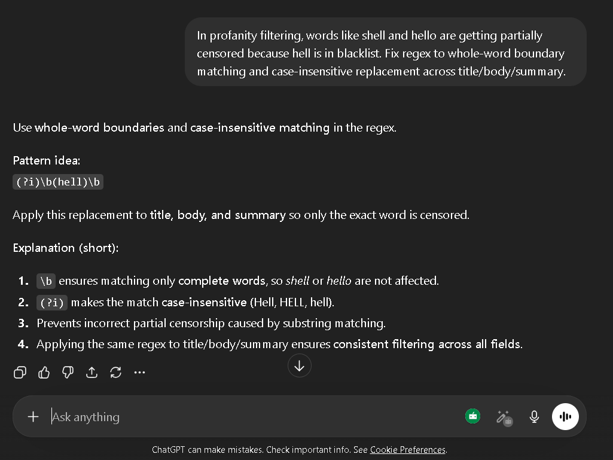

**How this helped in code:**
- Helped define a clean processing flow before save.
- Helped split processing into independent steps.

**Evaluation:**
- Correct high-level architecture guidance.
- Required adaptation to Roller action/save lifecycle.

---

### 2) Step-level implementation ideas
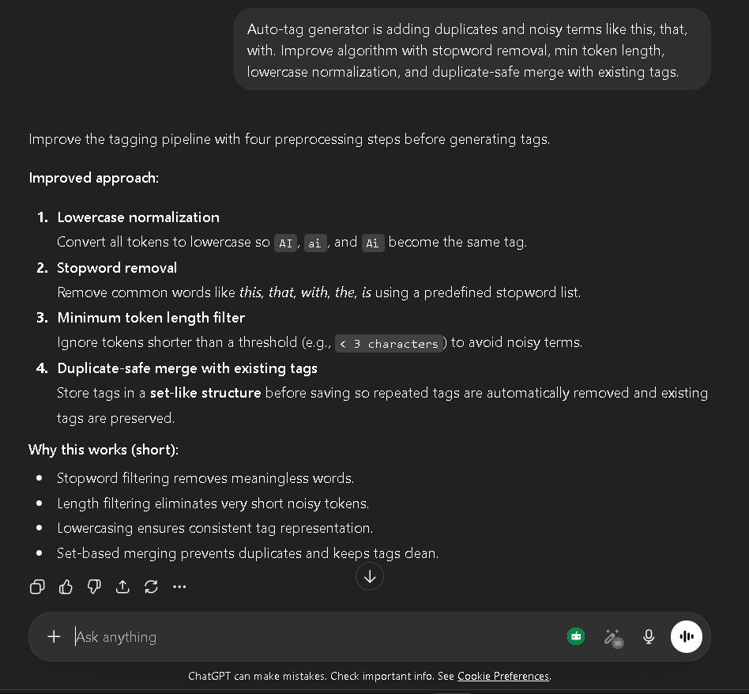

**How this helped in code:**
- Helped draft behavior for profanity filtering and length limiting.
- Helped shape configuration-driven behavior.

**Evaluation:**
- Useful as a baseline.
- Regex details and field handling (title/body/summary) required manual fixes.

---

### 3) Extensibility and toggles
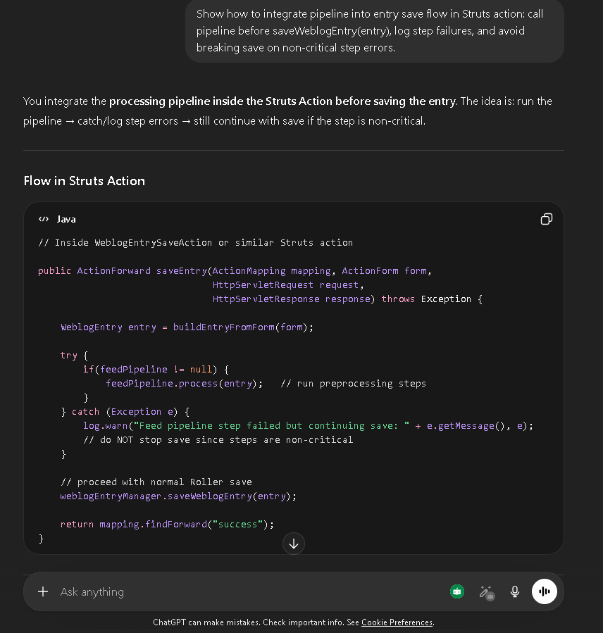

**How this helped in code:**
- Helped define per-step enable/disable keys.
- Reinforced add/remove-step design with minimal impact on other steps.

**Evaluation:**
- Correct modularity direction.
- Final property names and defaults were adjusted to project conventions.

---

### 4) Debugging and robustness checks
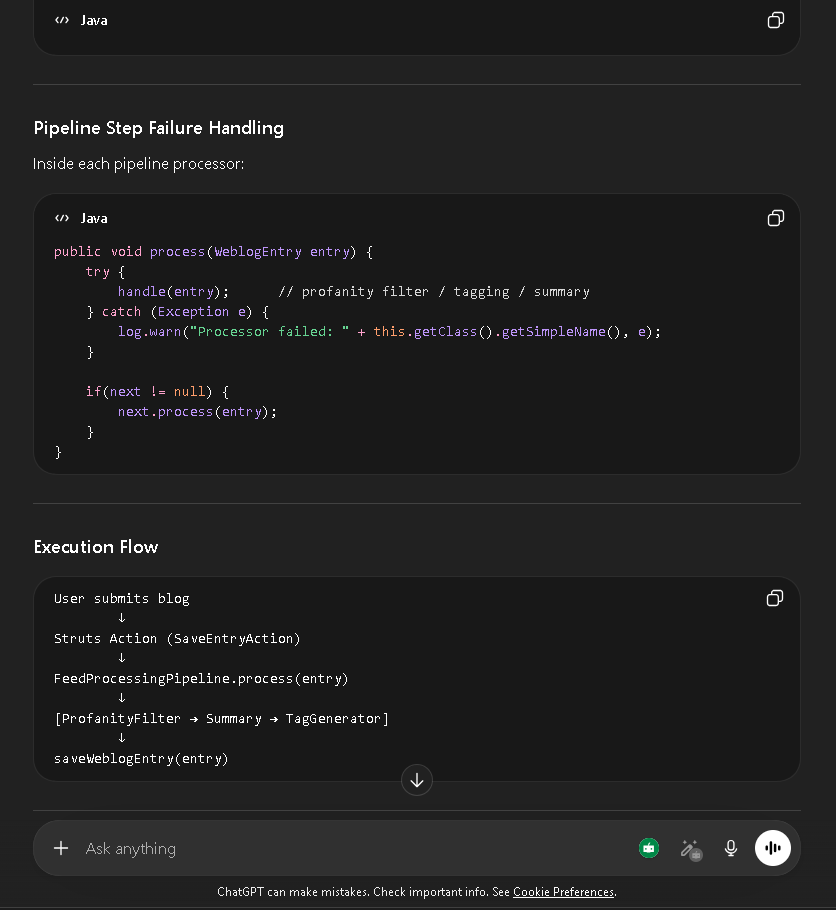

**How this helped in code:**
- Helped identify failure-handling expectations (non-critical step issues should not crash save).
- Helped list integration tests for end-to-end pipeline behavior.

**Evaluation:**
- Good test and resilience suggestions.
- Final save flow behavior was manually verified using real entry posting in Roller UI.

---

## Final Accuracy Summary
- LLM was useful for **pipeline decomposition, step responsibilities, and configuration strategy**.
- LLM output was **partially correct** and required manual code-level corrections.
- Final implementation was validated against assignment goals:
  - Multi-step processing pipeline
  - Config-based enable/disable support
  - Easy step add/remove behavior without breaking other steps


# Task 3 - Bug Report


## Screenshot Evidence

### 1) Clarify Task 3 requirements into a checklist

**Prompt:**

> “I already made my own Task 3 plan. Can you quickly list the must-have requirements so I can cross-check I didn’t miss anything, especially email triggers?”

**Screenshot:**

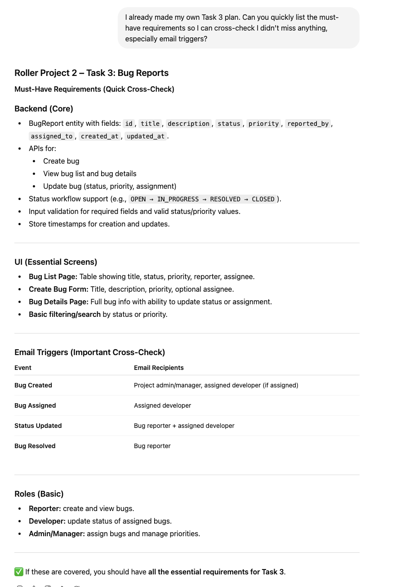

**What was correct / useful:**
The response correctly summarized the key implementation requirements for the bug reporting feature, including the core backend elements (BugReport entity, APIs for creating, viewing, and updating bugs), essential UI components (bug list, bug creation form, and bug details page), and the main workflow for bug status updates.

**What was incomplete / adjusted by us:**
The response provided a generalized checklist and did not include project-specific implementation details from the Apache Roller codebase, such as exact classes, services, or integration points where the bug report feature should be implemented. Some elements like role permissions, exact UI layout, and how email services integrate with the existing Roller infrastructure needed to be clarified and aligned with the project’s architecture.

**Net evaluation:**
The response was useful as a quick high-level checklist to validate that the major requirements were not missed, particularly the email trigger conditions and core feature components. However, it required refinement and adaptation to fit the specific structure and constraints of the Apache Roller codebase. Overall, the response served as a helpful starting point but needed manual adjustments for accurate implementation.


---

### 2) How to keep notifications modular for future Slack/Teams

**Why I asked:** I already had an event + channel idea in mind, and I just wanted a quick sanity check before coding.

**Prompt  :**

> “I’m thinking event + dispatcher + channel interface for notifications. Email first, maybe Slack/Teams later. Does this sound reasonable or am I missing something basic?”

**Screenshot:**

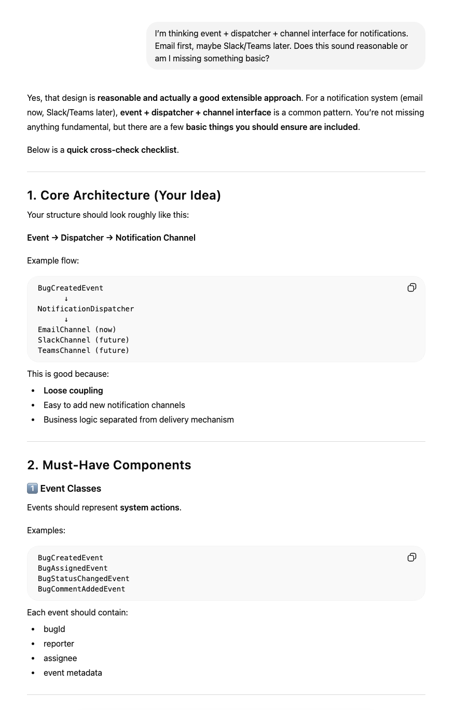
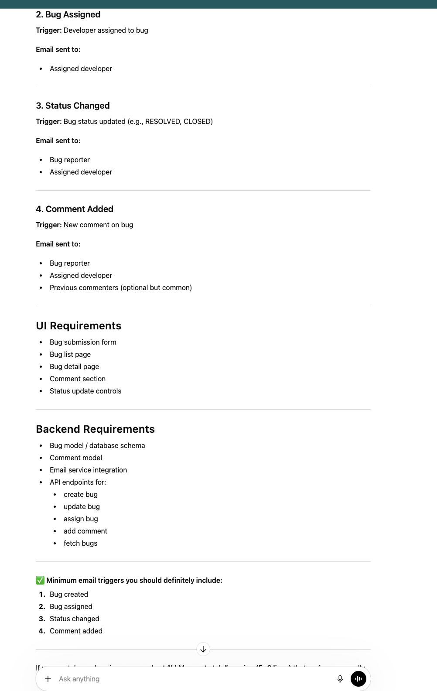

**What was correct / useful:**
The response suggested using an event-based notification system with a dispatcher and a channel interface. This was useful because it keeps the notification logic decoupled from the main application logic and makes it easier to extend the system later. The idea of having separate channels (like Email, Slack, or Teams) implementing a common interface also aligned well with our intended design. 

**What was incomplete / adjusted by us:**
Some practical aspects needed refinement when translating the suggestion into our plan. For example, the response mentioned concepts like async queues, template services, and advanced configuration, which were not necessary for our assignment scope.

**Net evaluation:**
Overall, the response was helpful in confirming that our planned architecture was reasonable and in highlighting a clean event-driven structure for notifications. However, it required some simplification and adjustment to match the assignment requirements and keep the implementation manageable.


---

### 3) How to send emails safely without breaking the DB transaction

**Why I asked:** I was about to wire the email calls and wanted one quick confirmation on failure handling.

**Prompt:**

> “Quick check: if mail sending fails, I still want bug save/update to succeed. What’s the safest way to handle this?”

**Screenshots:**

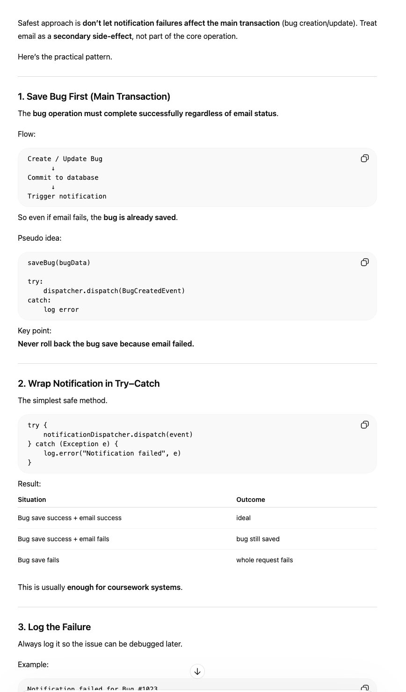

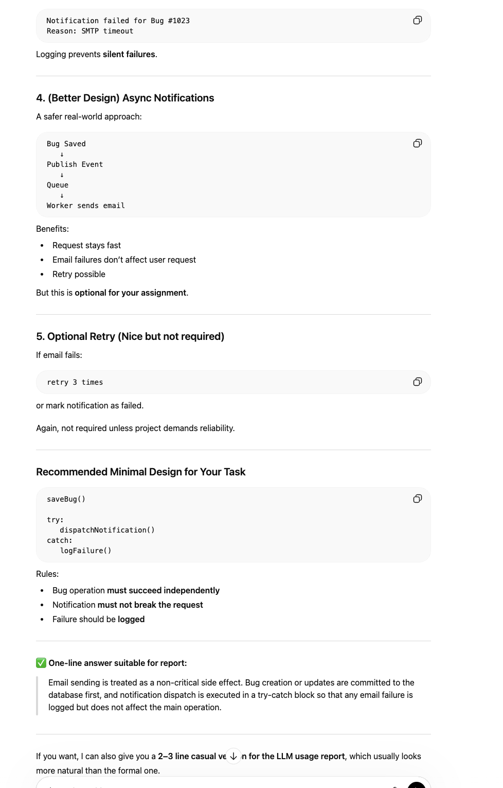

**What was correct / useful:**
The response correctly suggested separating the email notification logic from the main bug save/update operation. It recommended handling notifications as a secondary action and wrapping the email sending in a try–catch block so that even if the email fails, the main operation (saving or updating the bug) still succeeds.

**What was incomplete / adjusted by us:**
The response also mentioned more advanced options like using asynchronous queues and retry mechanisms for sending emails. While these are good practices in real-world systems, they were not necessary for the scope of our assignment.

**Net evaluation:**
Overall, the response was helpful in highlighting the correct way to isolate notification failures from the main workflow. It gave a clear direction for handling errors safely, though we simplified some of the suggested ideas to keep the implementation straightforward for the project.


---

### 4) Struts2 action structure (submit/list/admin dashboard)

**Why I asked:** I had already decided the pages, but I wanted a quick check that the split looked clean and not over-engineered.

**Prompt  :**

> “I’m planning 3 flows only: submit bug, my-bugs list (+ delete), and admin dashboard (+ status update/delete). Is this a good minimal split?”

**Screenshots:**

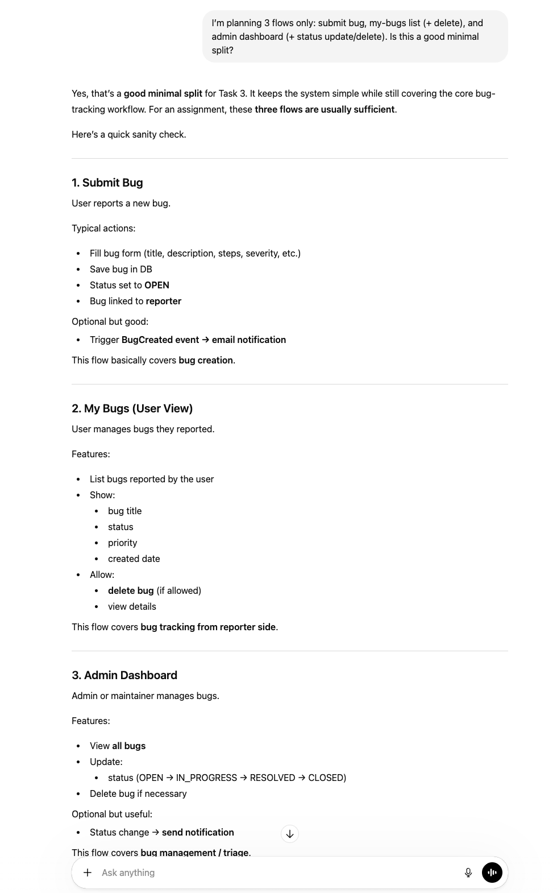

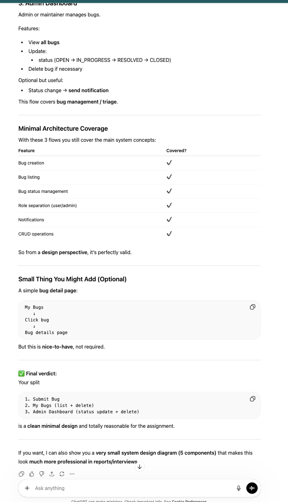

**What was correct / useful:**
The response confirmed that splitting the functionality into three main flows — submitting a bug, viewing a “my bugs” list, and having an admin dashboard — is a reasonable minimal design. It helped validate that these flows are enough to cover the basic lifecycle of bug reporting and management. 

**What was incomplete / adjusted by us:**
While the response suggested a few additional ideas like having a separate bug detail page or extra optional features, these were not strictly necessary for the scope of our task.

**Net evaluation:**
Overall, the response was helpful mainly as a quick validation that our planned structure was reasonable and not missing any essential components. Some of the additional suggestions were useful to think about, but we simplified the design to keep it aligned with the assignment requirements.


---

# Task 4 - Admin Dashboard

## Purpose
This document records how LLM assistance was used while implementing **Task 4**.

The screenshots below capture the prompt/response workflow used during coding, and the evaluation notes summarize where LLM output was useful and where manual corrections were applied.

---

## Screenshot Evidence

### 1) High-level design and planning
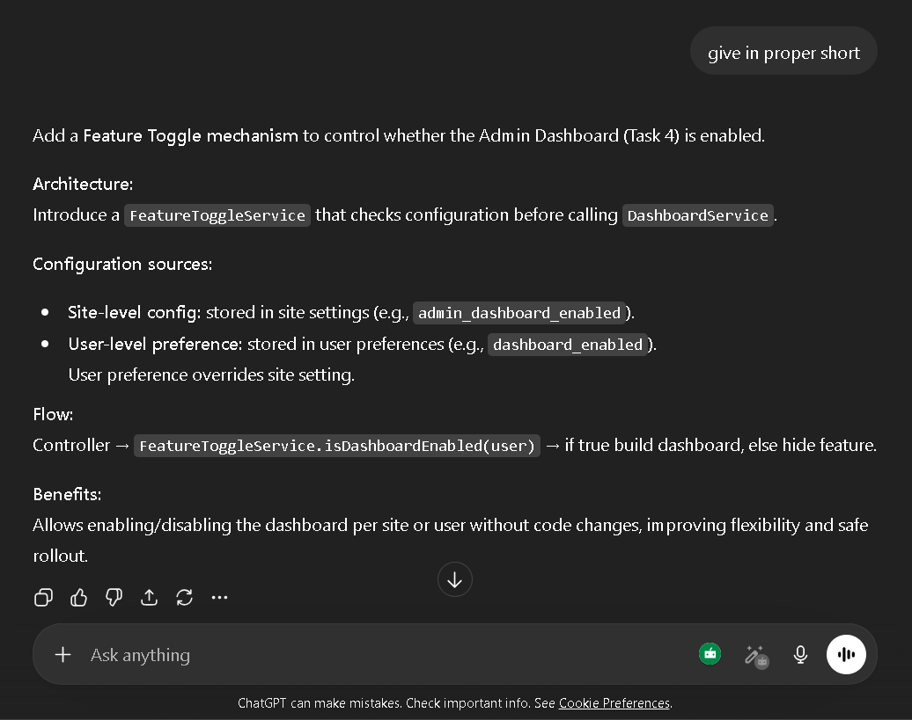

**How this helped in code:**
- Helped outline the feature architecture and integration points.
- Helped identify which existing services and templates to extend.

**Evaluation:**
- Correct high-level guidance.
- Required adaptation to project-specific lifecycle and naming conventions.

---

### 2) Step-level implementation suggestions
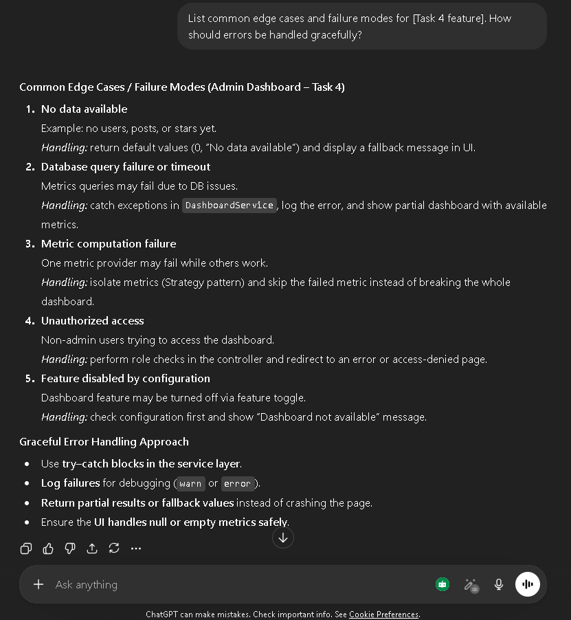

**How this helped in code:**
- Proposed candidate algorithms and helper methods.
- Suggested configuration keys and default values.

**Evaluation:**
- Useful baseline code and configuration ideas.
- Regex/edge-case details required manual refinement.

---

### 3) Testing and validation
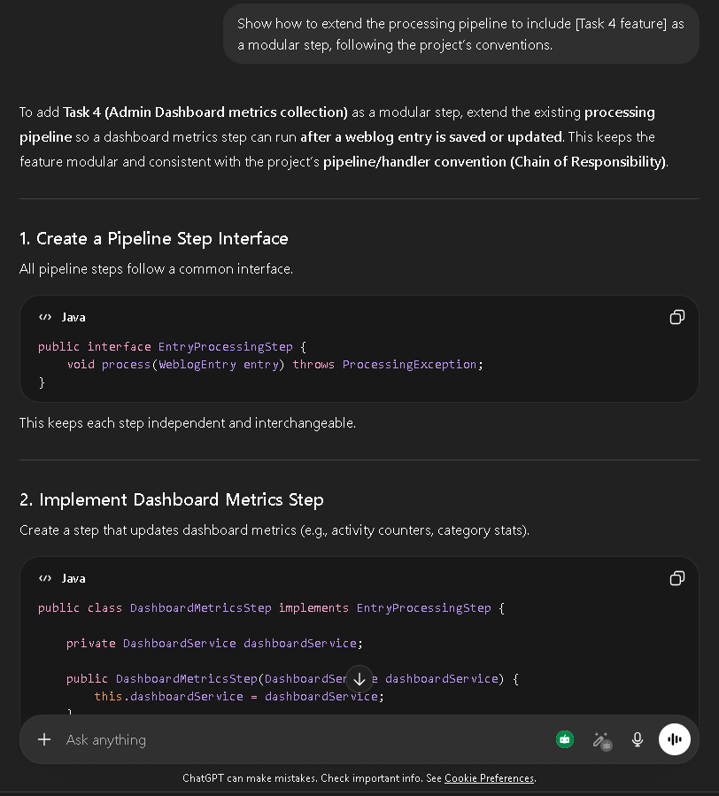

**How this helped in code:**
- Recommended unit and integration test cases.
- Suggested how to mock external dependencies for tests.

**Evaluation:**
- Test outlines were broadly correct.
- Test data and assertions were adjusted to match real responses.

---

### 4) Debugging and hardening
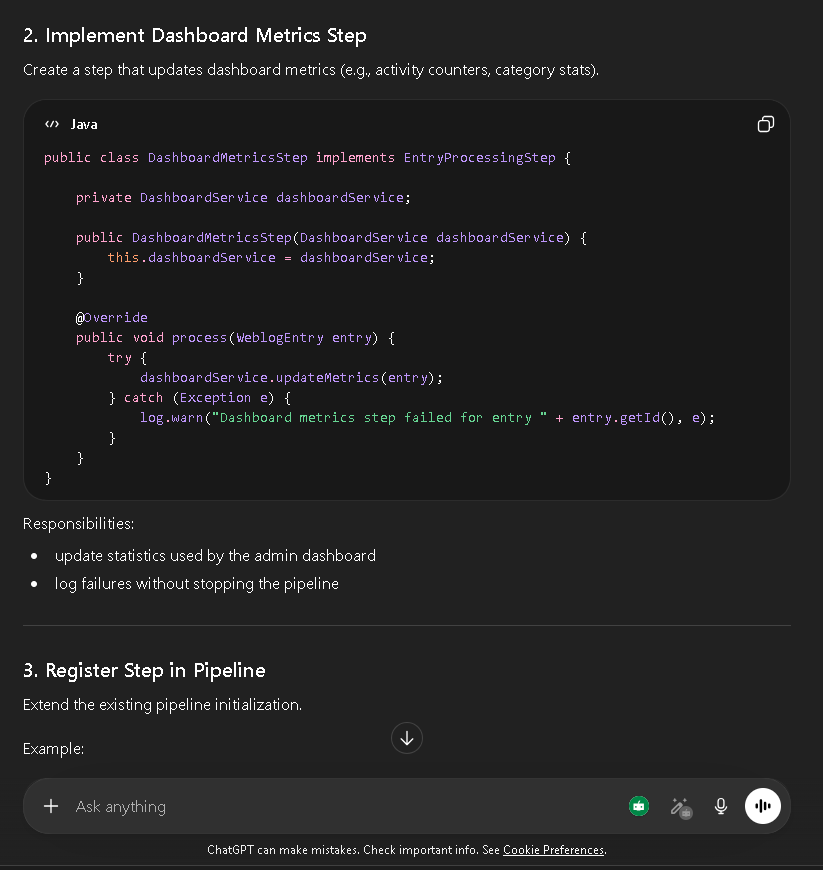

**How this helped in code:**
- Suggested failure modes and graceful degradation strategies.
- Helped define logging and monitoring points.

**Evaluation:**
- Good resilience recommendations.
- Final logging levels and messages were tuned manually.

---

## Final Accuracy Summary
- LLM was useful for **architecture decomposition, configuration strategy, and test scaffolding**.
- LLM output was **partially correct** and required manual code-level corrections and integration adjustments.
- Final implementation validation checklist:
  - Feature integrated into existing pipeline
  - Config-based toggles supported
  - Unit and integration tests added

---

# Task - 5

## Purpose
This document records how LLM assistance was used while implementing **Task 5 (Web Translation & Caching)**.

---

### 1) Root-cause diagnosis for unresolved `${env...}` placeholders

*Prompt used:*
```text
I have a Java webapp. When the translation feature runs it logs:
"Illegal character in path at index 1: ${env.TRANSLATION_SARVAM_API_URL}".
Relevant file: app/src/main/java/org/apache/roller/weblogger/business/translation/TranslationService.java (provider factory uses placeholders).
I attempted to inspect environment variables and .env. Please explain the most likely root cause and list 2–3 minimal diagnostic steps I can run locally (commands or small checks). Do NOT modify my code automatically — only explain what to check and why.
```


*How this helped in code:*
- Confirmed likely cause: unresolved placeholder passed into provider URL construction.
- Focused checks on env resolution path before changing Java logic.
- Avoided premature code edits and reduced debug scope.

*Evaluation:*
- High value for narrowing issue quickly.
- Good for triage and minimal reproducible diagnostics.

---

### 2) Manual smoke-test checklist for .env fallback + runtime switching

*Prompt used:*
```text
Give a short manual smoke-test checklist (3–6 steps) to validate: .env fallback works, Sarvam requests succeed, provider dropdown toggles providers without JVM restart, and cache keys include provider. Include the exact curl or mvn commands to run and the response JSON fields to inspect.
```


*How this helped in code:*
- Created direct API checks for metadata and translation endpoints.
- Validated provider switching behavior without restart.
- Verified provider-aware cache key behavior in browser localStorage.

*Evaluation:*
- Useful for quick regression testing after each patch.
- Practical and repeatable for team demos and grading evidence.

---

### 3) Runtime provider switching architecture (Sarvam vs Gemini)

*Prompt used:*
```text
Explain how to add runtime provider switching (e.g., choose sarvam vs gemini at request time) in this project. Sketch the high-level changes needed in:
- TranslationService (provider factory + per-request resolve),
- REST endpoint (accept provider param),
- frontend JS (send provider).
Give only the minimal method signatures and an outline of the flow — do not produce full class implementations.
```


*How this helped in code:*
- Clarified separation of concerns across service, servlet, and JS layers.
- Guided per-request provider resolution and providerPool reuse.
- Kept implementation minimal without overengineering.

*Evaluation:*
- Strong architectural guidance with low implementation risk.
- Easy to map into existing Roller code paths.

---

### 4) How to check if translation API is working

*Prompt used:*
```text
how to check api is working or not
```


*How this helped in code:*
- Standardized health checks: endpoint reachability, HTTP status, JSON fields.
- Added direct provider call validation to separate app-side vs upstream failures.
- Improved troubleshooting when Sarvam/Gemini behavior differs.

*Evaluation:*
- Simple but effective operational checklist.
- Good for quick sanity checks before deep debugging.

---

# Task 6  

## Purpose
This section records additional LLM interactions used while working on **Task 6A (Discussion Overview)** and **Task 6B (Conversation Breakdown)**.

---

## Screenshot Evidence

### 1) Rule-based comment classification design (Question/Feedback/Debate/Appreciation/Neutral)

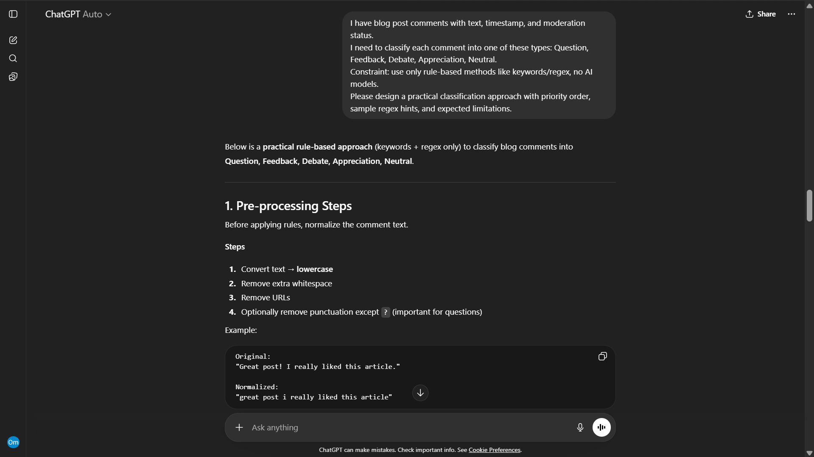
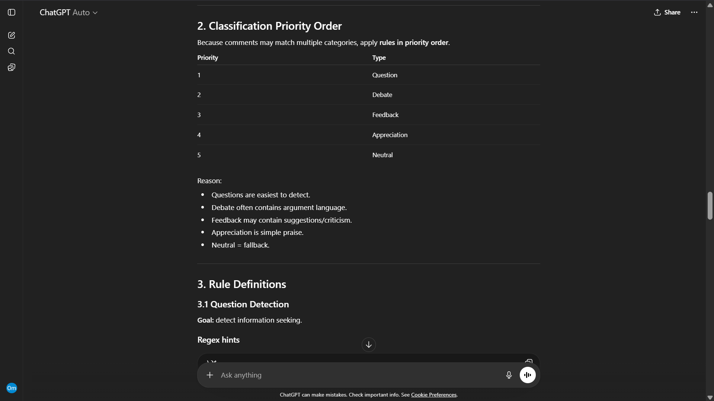
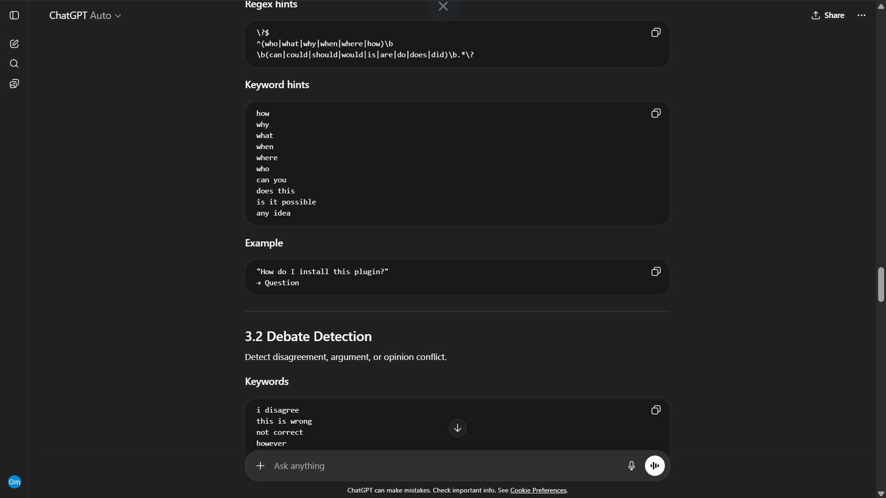
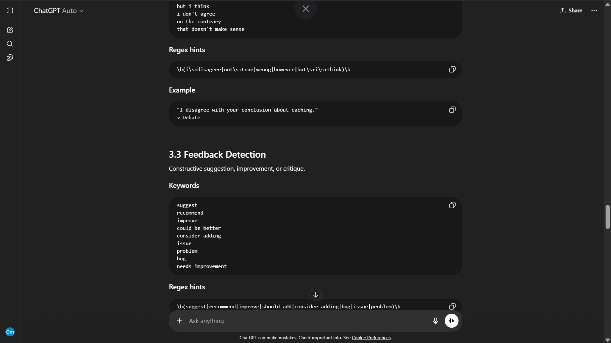
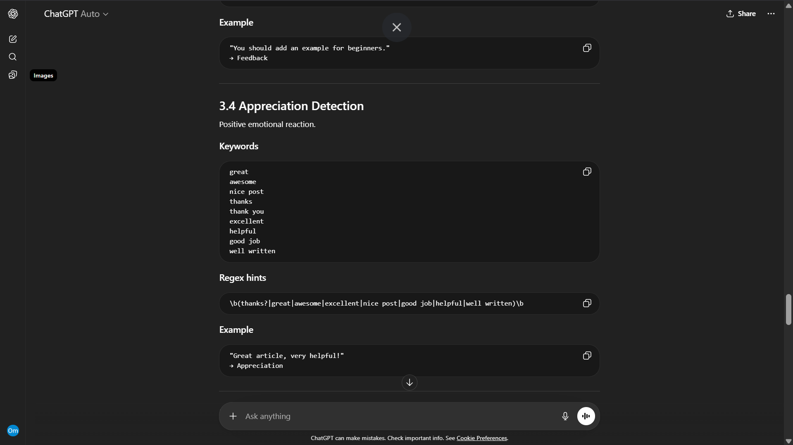
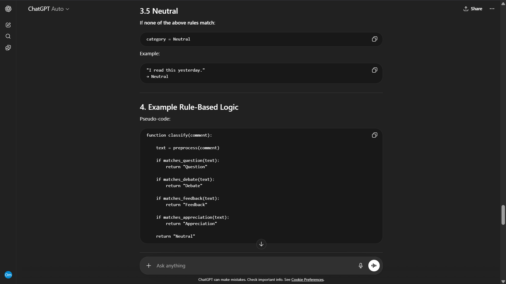
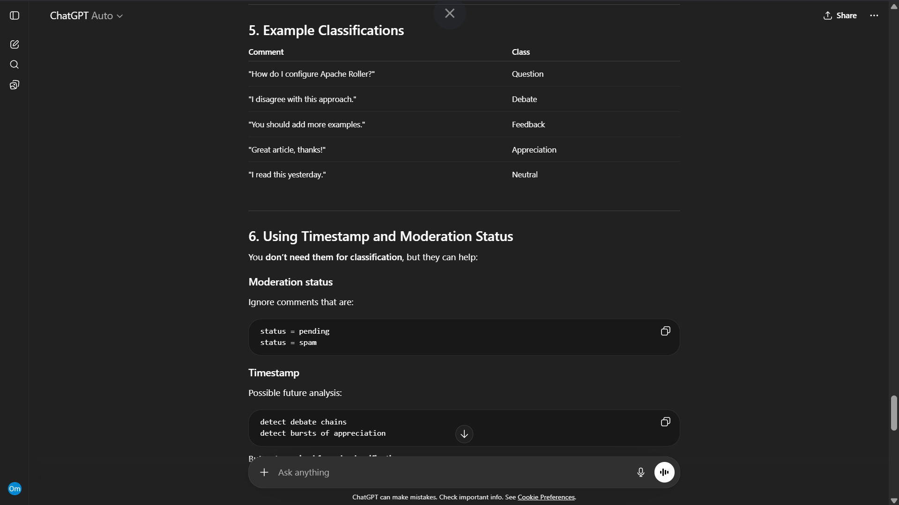
**Prompt used:**
I have blog post comments with text, timestamp, and moderation status. I need to classify each comment into one of these types: Question, Feedback, Debate, Appreciation, Neutral. Constraint: use only rule-based methods like keywords/regex, no AI models. Please design a practical classification approach with priority order, sample regex hints, and expected limitations.

**How this helped in code:**
- Helped define a deterministic classification pipeline using priority-ordered rules.
- Helped shape regex and keyword sets for each category.
- Helped with practical preprocessing steps (lowercasing, whitespace cleanup, punctuation handling).

**Evaluation:**
- Output was aligned with Task 6A constraints (classical methods only, no LLM in runtime pipeline).
- Regex/keyword lists required manual refinement for project-specific comment patterns and false-positive reduction.
- Final category mapping and status filtering logic were manually validated during integration.

---

### 2) Task 6B second-method design prompt (non-LLM alternative)

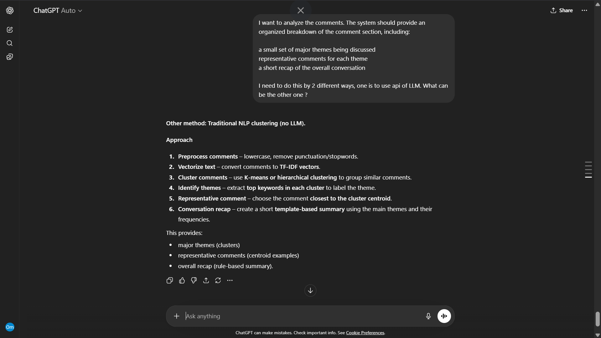

**Prompt used:**
I want to analyze the comments. The system should provide an organized breakdown of the comment section, including: a small set of major themes being discussed, representative comments for each theme, and a short recap of the overall conversation. I need to do this by 2 different ways, one is to use API of LLM. What can be the other one?

**How this helped in code:**
- Helped confirm a practical non-LLM alternative pipeline for Task 6B.
- Reinforced the use of classical steps: preprocessing, vectorization, clustering, theme labeling, representative selection, and template recap.
- Supported the final design decision to keep two distinct strategies (keyword/manual NLP and Gemini/LLM).

**Evaluation:**
- Output aligned with assignment intent of avoiding unnecessary LLM usage.
- High-level pipeline idea was useful, but concrete algorithm and integration details were implemented manually in project code.
- Final architecture used Strategy + Factory for runtime method switching and defaulted to non-LLM mode.

---

## Final Accuracy Summary
- LLM was useful for **rule template generation, category heuristics, and identifying a second non-LLM method for Task 6B**.
- LLM output was **not used directly**; regex lists, clustering behavior, and integration details were refined manually.
- Final implementation remained compliant with Task 6 constraints:
  - lightweight classical processing for low-cost analysis
  - two distinct methods for conversation breakdown
  - optional LLM usage only when explicitly selected