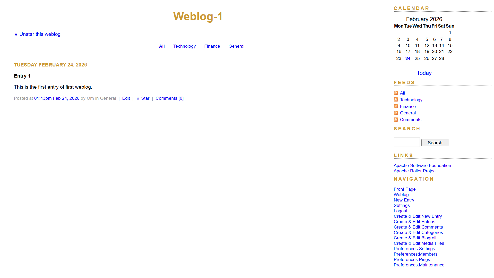
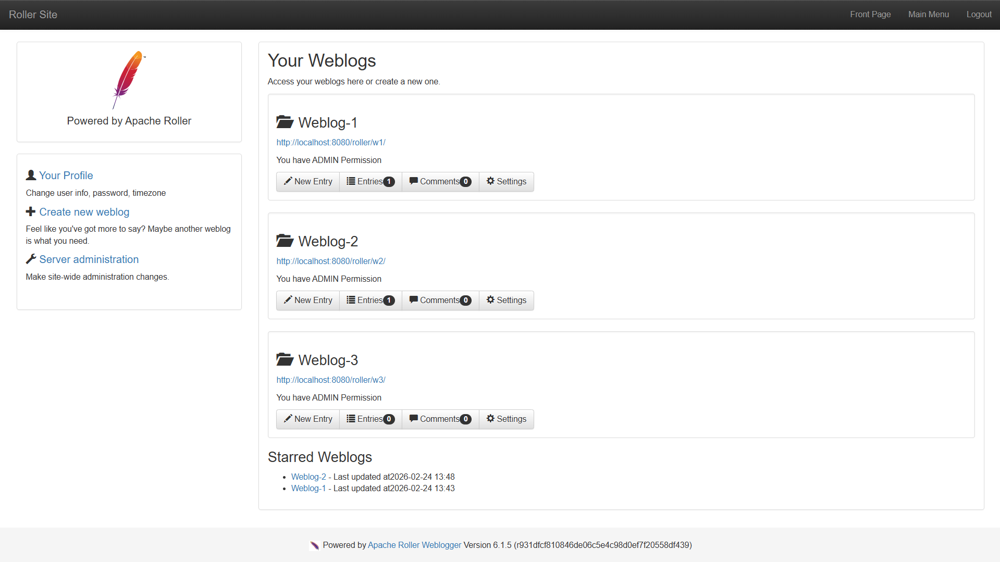

# Project 2 – Task 1A (Stars)

## Objective
Implement a starring system where users can:
1. Star/unstar weblogs (blog pages).
2. Star/unstar weblog entries (blog posts).
3. View all starred weblogs from their home page (Main Menu).
4. See starred weblogs sorted by most recently updated blogpost.
5. See the latest update date/time for each starred weblog.

---

## Functional Changes Implemented

### 1) Star / Unstar actions
- Added support for starring both target types: `WEBLOG` and `ENTRY`.
- Created a dedicated action `starAction` with methods `star` and `unstar`.
- Added safe return navigation so users are redirected back to the originating page after action completion.

**Key files**
- `app/src/main/java/org/apache/roller/weblogger/ui/struts2/core/StarAction.java`
- `app/src/main/resources/struts.xml`
- `app/src/main/java/org/apache/roller/weblogger/ui/rendering/model/PageModel.java`

### 2) UI controls for stars
- Added Star/Unstar controls in the Basic theme on:
  - weblog page,
  - permalink page,
  - entry list/day view.
- Added view-model checks to decide whether current user has already starred the target.

**Key files**
- `app/src/main/webapp/themes/basic/weblog.vm`
- `app/src/main/webapp/themes/basic/permalink.vm`
- `app/src/main/webapp/themes/basic/_day.vm`
- `app/src/main/java/org/apache/roller/weblogger/ui/rendering/model/PageModel.java`

### 3) Starred weblogs on home page (Main Menu)
- Added retrieval of starred weblogs in `MainMenu` action.
- Added rendering section in Main Menu JSP to display starred weblog list with links.
- Fetch size updated to include all starred weblogs (no hard cap).

**Key files**
- `app/src/main/java/org/apache/roller/weblogger/ui/struts2/core/MainMenu.java`
- `app/src/main/webapp/WEB-INF/jsps/core/MainMenu.jsp`

### 4) Sorting and timestamp display
- Implemented sorting by latest blogpost **update time** per starred weblog (`DESC`).
- Explicitly excludes comment recency from ranking.
- Shows date and time in Main Menu list.
- Shows fallback text (`No posts yet`) for starred weblogs with no published posts.

**Key files**
- `app/src/main/java/org/apache/roller/weblogger/business/jpa/JPAStarServiceImpl.java`
- `app/src/main/webapp/WEB-INF/jsps/core/MainMenu.jsp`
- `app/src/main/resources/ApplicationResources.properties`

---

## Business Layer / Wiring Changes

### Service and DTO additions
- Added `StarService` interface for star operations.
- Added `StarredWeblogView` DTO for Main Menu display (`weblog + latest update timestamp`).

### Core wiring
- Added `getStarService()` to `Weblogger`.
- Wired service into `WebloggerImpl` / `JPAWebloggerImpl` constructor chain.
- Added Guice binding `StarService -> JPAStarServiceImpl`.

**Key files**
- `app/src/main/java/org/apache/roller/weblogger/business/StarService.java`
- `app/src/main/java/org/apache/roller/weblogger/business/StarredWeblogView.java`
- `app/src/main/java/org/apache/roller/weblogger/business/Weblogger.java`
- `app/src/main/java/org/apache/roller/weblogger/business/WebloggerImpl.java`
- `app/src/main/java/org/apache/roller/weblogger/business/jpa/JPAWebloggerImpl.java`
- `app/src/main/java/org/apache/roller/weblogger/business/jpa/JPAWebloggerModule.java`

---

## Database / Persistence Changes

### New persistence entity
- Added `RollerStar` entity with fields:
  - `id`
  - `starredByUserId`
  - `targetEntityType`
  - `targetEntityId`
  - `starredAt`

### New table
- Added `roller_star` table in DB scripts.
- Added uniqueness rule to prevent duplicate stars for same user/target.
- Added indexes for user and target lookups.

### ORM registration and migration
- Added `RollerStar.orm.xml` mapping.
- Registered mapping in `persistence.xml`.
- Added migration script `610-to-620-migration` and included in `dbscripts.properties`.

**Key files**
- `app/src/main/java/org/apache/roller/weblogger/pojos/RollerStar.java`
- `app/src/main/resources/org/apache/roller/weblogger/pojos/RollerStar.orm.xml`
- `app/src/main/resources/META-INF/persistence.xml`
- `app/src/main/resources/sql/createdb.vm`
- `app/src/main/resources/sql/610-to-620-migration.vm`
- `app/src/main/resources/sql/dbscripts.properties`

---

## Testing
- Added `StarServiceTest` covering:
  - star weblog,
  - idempotent second star,
  - unstar weblog,
  - verification through `isStarred(...)`.

**Key file**
- `app/src/test/java/org/apache/roller/weblogger/business/StarServiceTest.java`

---

## Screenshot Placeholders

### 1) Star/Unstar weblog on weblog page and blogpost/entry

### 2) Main Menu with Starred Weblogs in sorted order (recent updates first)

---
