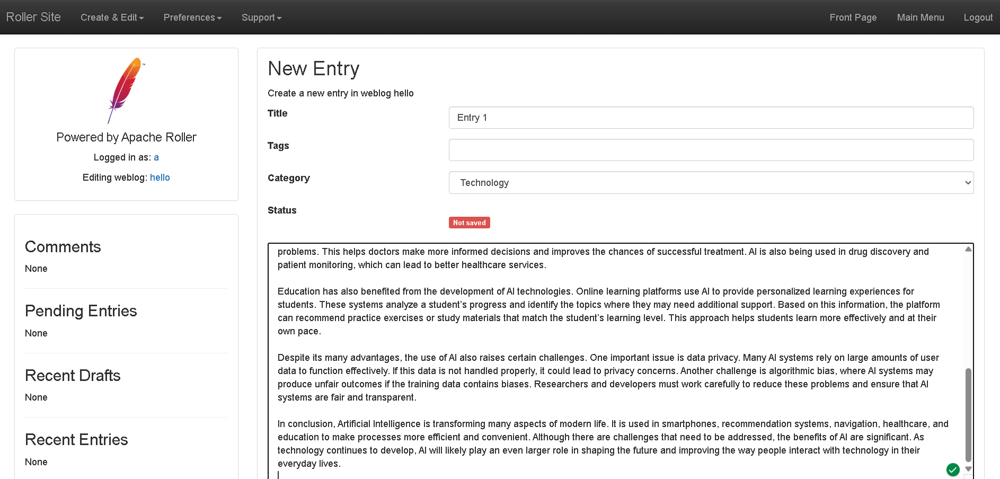
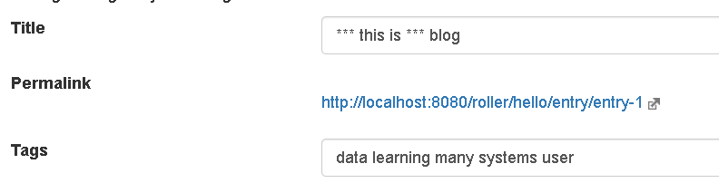
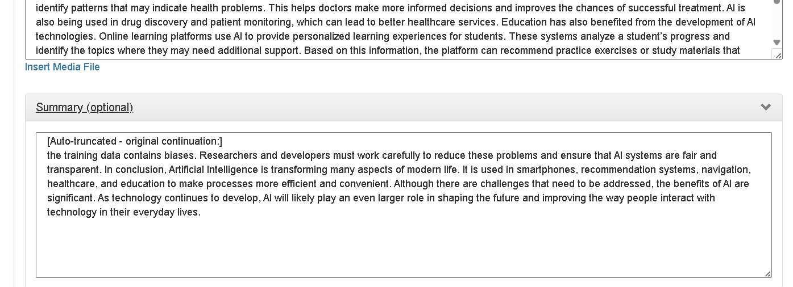

# Task 2 — Transforming Feeds

## Overview

This feature introduces a **blog-post processing pipeline** that runs automatically
whenever a user saves or posts a weblog entry. It allows admins to add, remove, or
reorder pre-processing steps without any impact on existing steps.

---

## Pipeline Flow

```
EntryEdit.save()
    │
    ▼
FeedProcessingPipeline.process(entry)   ← Singleton
    │
    ├──▶ ProfanityFilterStep      (enabled/disabled via config)
    │         │  replaces blacklisted words with ***
    │         ▼
    ├──▶ WordCountLimiterStep     (enabled/disabled via config)
    │         │  truncates body > maxWords; overflow → summary
    │         ▼
    └──▶ AutoTagGenerationStep    (enabled/disabled via config)
              │  extracts top-N keywords; appends as entry tags
              ▼
         weblogEntryManager.saveWeblogEntry(entry)
```

---

## Steps Implemented

### Step 1 — Profanity Filter (`ProfanityFilterStep`)

- Scans entry **title**, **body**, and **summary**.
- Replaces any word matching the configured blacklist with `***`.
- Matching is whole-word and case-insensitive (`\bword\b`).
- Blacklist is comma-separated in `roller.properties`:
  ```
  feed.pipeline.profanityFilter.wordlist=damn,hell,crap,...
  ```

### Step 2 — Word Count Limiter (`WordCountLimiterStep`)

- If the entry body exceeds the configured maximum word count, the body is
  truncated to the first `maxWords` words.
- The overflow text is moved to the entry summary (if no summary already exists)
  so authors can still review it before re-publishing.
- Configuration:
  ```
  feed.pipeline.wordCountLimiter.maxWords=500
  ```

### Step 3 — Automatic Tag Generation (`AutoTagGenerationStep`)

- Strips HTML from the body and tokenises the plain text.
- Removes common English stopwords and short words (< 4 characters).
- Counts word frequencies and picks the top-N most frequent words.
- Appends those words as tags on the entry (no duplicates added).
- Configuration:
  ```
  feed.pipeline.autoTag.maxTags=5
  ```

---

## Configuration Reference

All keys live in `roller.properties` (override in `roller-custom.properties`):

| Key | Default | Purpose |
|-----|---------|---------|
| `feed.pipeline.enabled` | `true` | Master switch — disables the entire pipeline |
| `feed.pipeline.profanityFilter.enabled` | `true` | Enable/disable profanity filter step |
| `feed.pipeline.profanityFilter.wordlist` | *(list)* | Comma-separated words to censor |
| `feed.pipeline.wordCountLimiter.enabled` | `true` | Enable/disable word-count limiter step |
| `feed.pipeline.wordCountLimiter.maxWords` | `500` | Maximum body word count |
| `feed.pipeline.autoTag.enabled` | `true` | Enable/disable auto-tag step |
| `feed.pipeline.autoTag.maxTags` | `5` | Number of auto-generated tags |

---

## Design Patterns Used

### 1. Chain of Responsibility

**Intent:** Pass a request along a chain of handlers. Each handler decides whether to process the request and whether to pass it on.

**Where used:** `FeedProcessingPipeline` + `FeedProcessingStep` + step implementations.

**How it applies:**
- `FeedProcessingStep` is the handler interface — every step implements `process(WeblogEntry)`.
- `FeedProcessingPipeline.process()` iterates the ordered list of steps and calls each enabled step in sequence, passing the (possibly modified) entry to the next.
- Each step is fully independent: it reads only its own config key, transforms only what it cares about, and has zero knowledge of the other steps.
- Adding or removing a step requires touching only the pipeline's step list — no existing handler, controller, or service changes.

```
FeedProcessingStep (interface)
        ▲
        │ implements
  ┌─────┼───────────────────────┐
  │     │                       │
ProfanityFilterStep   WordCountLimiterStep   AutoTagGenerationStep
```

**Key classes:**
- `business/feed/FeedProcessingStep.java` — handler interface (`getName`, `isEnabled`, `process`)
- `business/feed/FeedProcessingPipeline.java` — pipeline (iterates handlers in order)
- `business/feed/steps/ProfanityFilterStep.java` — concrete handler 1
- `business/feed/steps/WordCountLimiterStep.java` — concrete handler 2
- `business/feed/steps/AutoTagGenerationStep.java` — concrete handler 3

---

### 2. Strategy (implicit, via Chain of Responsibility)

**Intent:** Define a family of algorithms, encapsulate each one, and make them interchangeable.

**Where used:** Each `FeedProcessingStep` implementation is an interchangeable processing strategy.

**How it applies:**
- `FeedProcessingStep` defines the contract (`process(WeblogEntry)`).
- `ProfanityFilterStep`, `WordCountLimiterStep`, and `AutoTagGenerationStep` are three independent strategies — each encapsulates a different transformation algorithm.
- The pipeline treats all steps uniformly through the interface; swapping, reordering, or disabling a step has no effect on any other.
- Every step also acts as its own **Feature Flag**: `isEnabled()` reads a `roller.properties` key at call time, so steps can be toggled in production without a redeploy.

---

## Files Added / Modified

### New files

| File | Purpose |
|------|---------|
| `business/feed/FeedProcessingStep.java` | Interface for all pipeline steps |
| `business/feed/FeedProcessingPipeline.java` | Singleton Chain-of-Responsibility orchestrator |
| `business/feed/steps/ProfanityFilterStep.java` | Step 1 — profanity censorship |
| `business/feed/steps/WordCountLimiterStep.java` | Step 2 — body length enforcement |
| `business/feed/steps/AutoTagGenerationStep.java` | Step 3 — keyword-based tag generation |

### Modified files

| File | Change |
|------|--------|
| `ui/struts2/editor/EntryEdit.java` | Added `FeedProcessingPipeline.getInstance().process(weblogEntry)` before `saveWeblogEntry` |
| `config/roller.properties` | Added `feed.pipeline.*` configuration block |

---

## Screenshots

### 1. Posting a blog entry before pipeline



---

### 2. Entry saved — profanity filtered and auto-tags generated



---

### 3. Entry saved — body truncated by word-count limiter

<!-- Insert screenshot showing truncated body and overflow in summary -->


---
